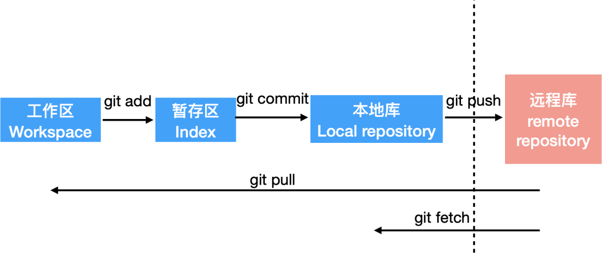

# Git

## 1.起步

### 1.1创建本地用户

```shell
$ git config --global user.name "Your Name"
$ git config --global user.email "email@example.com"
```

如果使用了 `--global` 选项，那么该命令只需要运行一次，因为之后无论你在该系统上做任何事情， Git 都会使用那些信息。 当你想针对特定项目使用不同的用户名称与邮件地址时，可以在那个项目目录下运行没有 `--global` 选项的命令来配置

### 1.2检查配置信息

```shell
$ git config --list
$ git config --system --list
$ git config --global --list
$ git config --local --list
```

可以通过输入 `git config <key>`： 来检查 Git 的某一项配置

### 1.3获取帮助

```shell
$ git <verb> -h
```

## 2.Git基础

### 2.1获取git仓库

#### 将尚未进行版本控制的本地目录转换为 Git 仓库

在项目目录下输入`git init`进行初始化，创建一个名叫.git的子目录

#### 从其它服务器 **克隆** 一个已存在的 Git 仓库

- 克隆并指定新的目录名

```shell
$ git clone git@github.com:Sprinining/res1.git myres1
```

### 2.2 记录每次更新到仓库

#### 文件状态


- 已跟踪：已跟踪的文件是指那些被纳入了版本控制的文件，在上一次快照中有它们的记录，在工作一段时间后， 它们的状态可能是未修改，已修改或已放入暂存区。简而言之，已跟踪的文件就是 Git 已经知道的文件。
- 未跟踪：除已跟踪文件外的其它所有文件都属于未跟踪文件，它们既不存在于上次快照的记录中，也没有被放入暂存区。 初次克隆某个仓库的时候，工作目录中的所有文件都属于已跟踪文件，并处于未修改状态，因为 Git 刚刚检出了它们， 而你尚未编辑过它们。

- `git status`查看当前文件状态

#### 跟踪新文件

- 使用命令`git add <file>`，注意，可反复多次使用，添加多个文件。可以用它开始==跟踪新文件==，或者==把已跟踪的文件放到暂存区==，还能用于==合并时把有冲突的文件标记为已解决状态==等
- `git status -s`查看简要信息

```console
$ git status -s
 M README
MM Rakefile
A  lib/git.rb
M  lib/simplegit.rb
?? LICENSE.txt
```

新添加的未跟踪文件前面有 `??` 标记，**新添加到暂存区中的文件**前面有 `A` 标记，**修改过的文件**前面有 `M` 标记。 输出中有两栏，**左栏指明了暂存区的状态，右栏指明了工作区的状态**。例如，上面的状态报告显示： `README` 文件在工作区已修改但尚未暂存，而 `lib/simplegit.rb` 文件已修改且已暂存。 `Rakefile` 文件已修，暂存后又作了修改，因此该文件的修改中既有已暂存的部分，又有未暂存的部分。

#### 忽略文件

- 设置.gitignore文件
  - 所有空行或者以 `#` 开头的行都会被 Git 忽略。
  - 可以使用标准的 glob 模式匹配，它会递归地应用在整个工作区中。
  - 匹配模式可以以（`/`）开头防止递归。
  - 匹配模式可以以（`/`）结尾**指定目录**。
  - 要忽略指定模式以外的文件或目录，可以在模式前加上叹号（`!`）取反。

- 所谓的 glob 模式是指 shell 所使用的简化了的正则表达式。 
  - 星号（`*`）匹配零个或多个任意字符；
  - `[abc]` 匹配任何一个列在方括号中的字符 （这个例子要么匹配一个 a，要么匹配一个 b，要么匹配一个 c）；
  -  问号（`?`）只匹配一个任意字符；
  - 如果在方括号中使用短划线分隔两个字符， 表示所有在这两个字符范围内的都可以匹配（比如 `[0-9]` 表示匹配所有 0 到 9 的数字）。 
  - 使用两个星号（`**`）表示**匹配任意中间目录**，比如 `a/**/z` 可以匹配 `a/z` 、 `a/b/z` 或 `a/b/c/z` 等。

```python
# 忽略所有的 .a 文件
*.a

# 但跟踪所有的 lib.a，即便你在前面忽略了 .a 文件
!lib.a

# 只忽略当前目录下的 TODO 文件，而不忽略 subdir/TODO
/TODO

# 忽略任何目录下名为 build 的文件夹
build/

# 忽略 doc/notes.txt，但不忽略 doc/server/arch.txt
doc/*.txt

# 忽略 doc/ 目录及其所有子目录下的 .pdf 文件
doc/**/*.pdf
```

#### 查看已暂存和未暂存的修改

- `git diff`  ==比对工作区文件与最后一次提交的文件差异==
- `git diff --staged` 命令。 ==比对暂存区文件与最后一次提交的文件差异==

#### 提交更新

- `git commit`会**启动文本编辑器来输入提交说明**（启动的编辑器是通过 Shell 的环境变量 `EDITOR` 指定的，一般为 vim 或 emacs。 当然也可以使用 `git config --global core.editor` 命令设置编辑器。）
- 使用命令`git commit -m <message>`，完成。
- 提交时记录的是**放在暂存区域的快照**。 任何还未暂存文件的仍然保持已修改状态，可以在下次提交时纳入版本管理。 每一次运行提交操作，都是对你项目作一次快照，以后可以回到这个状态，或者进行比较。
- `git config core.autocrlf false`**消除换行符警告**

#### 跳过git add

- 给 `git commit` 加上 `-a` 选项，Git 就会自动把**所有已经跟踪过的文件**暂存起来一并提交，从而跳过 `git add` 步骤

#### 删除文件

- 如果对已被追踪的文件手动删除，运行 **git status** 时就会在 **Changes not staged for commit** 的提示，需要`git add`添加这次删除或者`git rm`删除暂存区和工作区的
- 将文件从暂存区和工作区中删除

```shell
$ git rm <file>
```

- 如果删除之前修改过并且==已经放到暂存区域的话，则必须要用强制删除选项 **-f**==
- 把文件从暂存区移除，但保留在当前工作目录中（仅是从跟踪清单中删除，文件保留在磁盘，git不再跟踪）

```shell
$ git rm --cached <file>
```

#### 移动文件

```shell
$ git mv file_from file_to
```

- 运行 `git mv` 就相当于运行了下面三条命令：

```shell
$ mv README.md README
$ git rm README.md
$ git add README
```

### 2.3查看提交历史

- `git log`按时间先后顺序列出所有的提交，最近的更新排在最上面。 正如你所看到的，这个命令会列出每个提交的 SHA-1 校验和、作者的名字和电子邮件地址、提交时间以及提交说明。
-  `-p` 或 `--patch` ，它会显示每次提交所引入的差异（按 **补丁** 的格式输出）。 你也可以限制显示的日志条目数量，例如使用 `-2` 选项来只显示最近的两次提交

| 选项              | 说明                                                         |
| :---------------- | :----------------------------------------------------------- |
| `-p`              | **按补丁格式显示每个提交引入的差异。**                       |
| `--stat`          | **显示每次提交的文件修改统计信息。**                         |
| `--shortstat`     | 只显示 --stat 中最后的行数修改添加移除统计。                 |
| `--name-only`     | 仅在提交信息后显示已修改的文件清单。                         |
| `--name-status`   | 显示新增、修改、删除的文件清单。                             |
| `--abbrev-commit` | 仅显示 SHA-1 校验和所有 40 个字符中的前几个字符。            |
| `--relative-date` | 使用较短的相对时间而不是完整格式显示日期（比如“2 weeks ago”）。 |
| `--graph`         | 在日志旁以 ASCII 图形显示分支与合并历史。                    |
| `--pretty`        | 使用其他格式显示历史提交信息。可用的选项包括 oneline、short、full、fuller 和 format（用来定义自己的格式）。 |
| `--oneline`       | **`--pretty=oneline --abbrev-commit` 合用的简写。**          |

| 选项                      | 说明                                           |
| :------------------------ | :--------------------------------------------- |
| `-<n>`                    | **仅显示最近的 n 条提交。**                    |
| `--since`, `--after`      | **仅显示指定时间之后的提交。**                 |
| `--until`, `--before**`** | **仅显示指定时间之前的提交。**                 |
| `--author`                | **仅显示作者匹配指定字符串的提交。**           |
| `--committer`             | 仅显示提交者匹配指定字符串的提交。             |
| `--grep`                  | **仅显示提交说明中包含指定字符串的提交。**     |
| `-S`                      | **仅显示添加或删除内容匹配指定字符串的提交。** |

### 2.4撤销操作

#### 覆盖提交

- 修改上次的提交信息，或者添加或修改文件，==覆盖上次的提交==：

```shell
$ git commit --amend
```

#### 取消暂存的文件

- `git reset HEAD <file>  `或者`git restore --staged <file>`从暂存区移除文件

#### 撤销对文件的修改

- `git checkout -- <file> ` 是一个危险的命令。对文件在本地的任何修改都会被最近一次提交的版本覆盖掉，==只是覆盖工作区==，暂存区的内容不会被覆盖

### 2.5远程仓库

- 查看已经配置的远程仓库服务器，可以运行 `git remote` 命令
- 指定选项 `-v`，会显示需要读写远程仓库使用的 Git 保存的简写与其对应的 URL
- `git remote add <shortname> <url>` 添加一个新的远程 Git 仓库，同时指定一个方便使用的简写

- `git fetch <remote> `访问远程仓库，从中拉取所有没有的数据，拉取到远程分支。 执行完成后，必须手动将其合并入当前分支
- `git remote rename`重命名，`git remote rm`删除

### 2.6打标签

- `git tag`显示已有标签
- ` git tag -l "v1.8.5*"`使用 统配模式时，`-l`是必须的

#### 附注标签

- `git tag -a v1.4 -m "my version 1.4"`，-m 选项指定了一条将会存储在标签中的信息。 如果没有为附注标签指定一条信息，Git 会启动编辑器要求输 入信息
- `git show v1.4`显示标签具体内容

#### 轻量标签

- ` git tag v1.4-lw`只需提供名字

#### 对之前的提交打标签

- `git tag -a v1.2 哈希值`

#### 共享标签

- `git push origin <tagname> `
- `git push origin --tags`会把所有不在远程仓库服务器上的标签全部传送到那

#### 删除标签

- `git tag -d <tagname> `删除本地仓库的标签
- `git push <remote> :refs/tags/<tagname>`更新到远程仓库，或者是`git push origin -d <tagname>`

#### 检出标签

- `git checkout -b version2 v2.0.0`通常需要创建一个新分支

### 2.7Git别名

- `  git config --global alias.ll 'log --oneline --graph'`: 用`git ll ` 代替 `git log --oneline --graph`


## Git分支


### 版本回退

- 要随时掌握工作区的状态，使用`git status`命令。

- 如果`git status`告诉你有文件被修改过，用`git diff`可以查看修改内容。

- 用`HEAD`表示当前版本，上一个版本就是`HEAD^`，上上一个版本就是`HEAD^^`，往上n个版本为HEAD~n。

- 使用命令`git reset --hard commit_id`可以切换版本。

  - $ git reset --hard xxx

    三个区都同步，都跳到这个 xxx 的版本上。

  - $ git reset --soft xxx

    前面两个区不同步，就只有本地库跳到这个版本。

  - $ git reset --mixed xxx

    暂存区同步，工作区不动。

- 用`git log`可以查看提交历史，以便确定要回退到哪个版本。--pretty=oneline显示简要信息。

- 用`git reflog`查看命令历史，以便确定要回到未来的哪个版本。

### 撤销修改

- 命令`git checkout -- readme.txt`意思就是，把`readme.txt`文件在工作区的修改全部撤销，这里有两种情况：
  - `readme.txt`自修改后还没有被放到暂存区，现在，撤销修改就回到和版本库一模一样的状态；
  - `readme.txt`已经添加到暂存区后，又作了修改，现在，撤销修改就回到添加到暂存区后的状态。
  总之，就是让这个文件**回到最近一次`git commit`或`git add`时的状态**。

- 用命令`git reset HEAD <file>`可以把暂存区的修改撤销掉（unstage），重新放回工作区。

场景1：当你改乱了工作区某个文件的内容，想直接丢弃工作区的修改时，用命令`git checkout -- file`。

场景2：当你不但改乱了工作区某个文件的内容，还添加到了暂存区时，想丢弃修改，分两步，第一步用命令`git reset HEAD <file>`，就回到了场景1，第二步按场景1操作。

场景3：已经提交了不合适的修改到版本库时，想要撤销本次提交，参考版本回退一节，不过前提是没有推送到远程库。

### 删除

如果在文件管理器中直接删除文件，git会发现有文件被删除了。现在有两个选择：

- 确实要从版本库中删除该文件，那就用命令`git rm`删掉，并且`git commit`。
- 另一种情况是删错了，因为版本库里还有呢，所以可以很轻松地把误删的文件恢复到最新版本：

```shell
$ git checkout -- test.txt
```

`git checkout`其实是**用版本库里的版本替换工作区的版本**，无论工作区是修改还是删除，都可以“一键还原”。

命令`git rm`用于删除一个文件。如果一个文件已经被提交到版本库，那么永远不用担心误删，但是只能恢复文件到最新版本，会丢失**最近一次提交后修改的内容**。

## 远程仓库

### 把一个已有的本地仓库与之关联，然后把本地仓库的内容推送到GitHub仓库

- 与远程库关联

```shell
$ git remote add origin git@github.com:username/learngit.git
```

- 把本地库的所有内容推送到远程库上

```shell
$ git push -u origin master
```

第一次推送`master`分支时，加上了`-u`参数，Git不但会把本地的`master`分支内容推送的远程新的`master`分支，还会把本地的`master`分支和远程的`master`分支关联起来，在以后的推送或者拉取时就可以简化命令。

- 把本地`master`分支的最新修改推送至GitHub。

```shell
$ git push origin master
```

- 如果添加的时候地址写错了，或者就是想删除远程库，可以用`git remote rm <name>`命令。使用前，建议先用`git remote -v`查看远程库信息，然后根据名字删除。此处的“删除”其实是解除了本地和远程的绑定关系，并不是物理上删除了远程库。

### 从github仓库克隆出新的仓库

- 克隆到本地文件夹

```shell
$ git clone git@github.com:username/learngit.git
```

## 分支管理




### 创建与合并分支

- 查看分支：`git branch`

- 创建分支：`git branch <name>`

- 切换分支：`git checkout <name>`或者`git switch <name>`

- 创建+切换分支：`git checkout -b <name>`或者`git switch -c <name>`

- 合并某分支到当前分支：`git merge <name>`

- 删除分支：`git branch -d <name>`

- 合并分支图：git log --graph
- 合并分支时，加上`--no-ff`参数就可以用普通模式合并，合并后的历史有分支，能看出来曾经做过合并，而`fast forward`合并就看不出来曾经做过合并。`$ git merge --no-ff -m "merge with no-ff" dev`

### 解决冲突

`git diff --name-only --diff-filter=U`查看冲突

### 删除远程分支

- 删除

`git push origin --delete dev`

- 查看所有分支

`git branch -a`

- 查看远程分支

`git branch -r`

### 分支管理策略


### Bug分支


### Feature分支


## 标签管理

- 切换到需要打标签的分支上，敲命令`git tag <name>`就可以打一个新标签：

  ```shell
  $ git tag v1.0
  ```

  可以用命令`git tag`查看所有标签：

  ```shell
  $ git tag
  v1.0
  ```

- 命令`git tag <tagname>`用于新建一个标签，默认为`HEAD`，也可以指定一个commit id；

- 命令`git tag -a <tagname> -m "blablabla..."`可以指定标签信息；

- 命令`git tag`可以查看所有标签。

- 用`git show <tagname>`查看标签信息。

- 命令`git push origin <tagname>`可以推送一个本地标签；

- 命令`git push origin --tags`可以推送全部未推送过的本地标签；

- 命令`git tag -d <tagname>`可以删除一个本地标签；

- 命令`git push origin :refs/tags/<tagname>`可以删除一个远程标签。

## 3.分支

