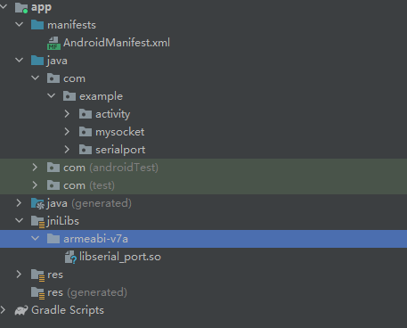
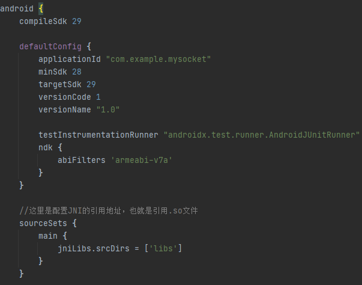
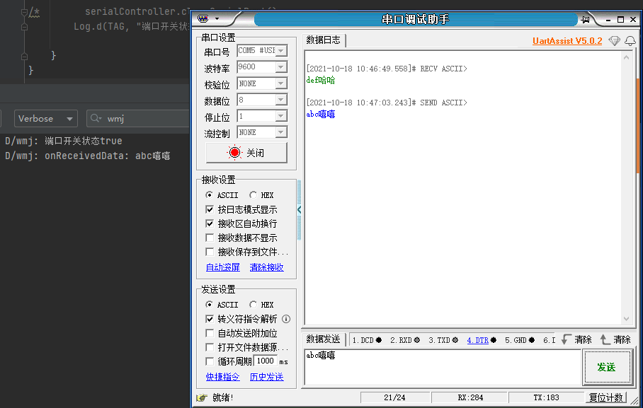

# 串口开发

## 编译so文件和项目配置

- google串口api下载https://github.com/cepr/android-serialport-api

- 修改android-serialport-api-master\android-serialport-api-master\android-serialport-api\project\jni目录下的Android.mk、Application.mk和SerialPort.c文件
- Android.mk修改解决==libserial_port.so: has text relocations异常==

```makefile
#当前文件夹
LOCAL_PATH := $(call my-dir)

include $(CLEAR_VARS)
#目标版本
TARGET_PLATFORM := android-29
#要生成的module
LOCAL_MODULE    := serial_port
LOCAL_SRC_FILES := SerialPort.c
LOCAL_LDLIBS    := -llog
#加上此句
LOCAL_LDFLAGS += -fPIC

include $(BUILD_SHARED_LIBRARY)
```

原因在于加载的so库需要重定位, Android 6.0及更高版本已明文禁止此种情形发生。在Android 6.0之前，text reloactions的问题，会在编译的过程中，作为warning报出来；在Android 6.0以上版本，升级为error了。

- Application.mk修改

```makefile
APP_ABI := armeabi-v7a
```

- SerialPort.c修改解决==java.lang.UnsatisfiedLinkError: No implementation found for java.io.FileDescriptor com.example.serialport.SerialPort.open(java.lang.String, int, int) (tried Java_com_example_serialport_SerialPort_open and Java_com_example_serialport_SerialPort_open__Ljava_lang_String_2II)异常==

```c
#include <termios.h>
#include <unistd.h>
#include <sys/types.h>
#include <sys/stat.h>
#include <fcntl.h>
#include <string.h>
#include <jni.h>

#include "SerialPort.h"

#include "android/log.h"
static const char *TAG="serial_port";
#define LOGI(fmt, args...) __android_log_print(ANDROID_LOG_INFO,  TAG, fmt, ##args)
#define LOGD(fmt, args...) __android_log_print(ANDROID_LOG_DEBUG, TAG, fmt, ##args)
#define LOGE(fmt, args...) __android_log_print(ANDROID_LOG_ERROR, TAG, fmt, ##args)

static speed_t getBaudrate(jint baudrate)
{
	switch(baudrate) {
	case 0: return B0;
	case 50: return B50;
	case 75: return B75;
	case 110: return B110;
	case 134: return B134;
	case 150: return B150;
	case 200: return B200;
	case 300: return B300;
	case 600: return B600;
	case 1200: return B1200;
	case 1800: return B1800;
	case 2400: return B2400;
	case 4800: return B4800;
	case 9600: return B9600;
	case 19200: return B19200;
	case 38400: return B38400;
	case 57600: return B57600;
	case 115200: return B115200;
	case 230400: return B230400;
	case 460800: return B460800;
	case 500000: return B500000;
	case 576000: return B576000;
	case 921600: return B921600;
	case 1000000: return B1000000;
	case 1152000: return B1152000;
	case 1500000: return B1500000;
	case 2000000: return B2000000;
	case 2500000: return B2500000;
	case 3000000: return B3000000;
	case 3500000: return B3500000;
	case 4000000: return B4000000;
	default: return -1;
	}
}

// 此处修改成对应的java包名com.example.serialport
JNIEXPORT jobject JNICALL Java_com_example_serialport_SerialPort_open
  (JNIEnv *env, jclass thiz, jstring path, jint baudrate, jint flags)
{
	int fd;
	speed_t speed;
	jobject mFileDescriptor;

	/* Check arguments */
	{
		speed = getBaudrate(baudrate);
		if (speed == -1) {
			/* TODO: throw an exception */
			LOGE("Invalid baudrate");
			return NULL;
		}
	}

	/* Opening device */
	{
		jboolean iscopy;
		const char *path_utf = (*env)->GetStringUTFChars(env, path, &iscopy);
		LOGD("Opening serial port %s with flags 0x%x", path_utf, O_RDWR | flags);
		fd = open(path_utf, O_RDWR | flags);
		LOGD("open() fd = %d", fd);
		(*env)->ReleaseStringUTFChars(env, path, path_utf);
		if (fd == -1)
		{
			/* Throw an exception */
			LOGE("Cannot open port");
			/* TODO: throw an exception */
			return NULL;
		}
	}

	/* Configure device */
	{
		struct termios cfg;
		LOGD("Configuring serial port");
		if (tcgetattr(fd, &cfg))
		{
			LOGE("tcgetattr() failed");
			close(fd);
			/* TODO: throw an exception */
			return NULL;
		}

		cfmakeraw(&cfg);
		cfsetispeed(&cfg, speed);
		cfsetospeed(&cfg, speed);

		if (tcsetattr(fd, TCSANOW, &cfg))
		{
			LOGE("tcsetattr() failed");
			close(fd);
			/* TODO: throw an exception */
			return NULL;
		}
	}

	/* Create a corresponding file descriptor */
	{
		jclass cFileDescriptor = (*env)->FindClass(env, "java/io/FileDescriptor");
		jmethodID iFileDescriptor = (*env)->GetMethodID(env, cFileDescriptor, "<init>", "()V");
		jfieldID descriptorID = (*env)->GetFieldID(env, cFileDescriptor, "descriptor", "I");
		mFileDescriptor = (*env)->NewObject(env, cFileDescriptor, iFileDescriptor);
		(*env)->SetIntField(env, mFileDescriptor, descriptorID, (jint)fd);
	}

	return mFileDescriptor;
}


// 此处修改成对应的java包名com.example.serialport
JNIEXPORT void JNICALL Java_com_example_serialport_SerialPort_close
  (JNIEnv *env, jobject thiz)
{
	jclass SerialPortClass = (*env)->GetObjectClass(env, thiz);
	jclass FileDescriptorClass = (*env)->FindClass(env, "java/io/FileDescriptor");

	jfieldID mFdID = (*env)->GetFieldID(env, SerialPortClass, "mFd", "Ljava/io/FileDescriptor;");
	jfieldID descriptorID = (*env)->GetFieldID(env, FileDescriptorClass, "descriptor", "I");

	jobject mFd = (*env)->GetObjectField(env, thiz, mFdID);
	jint descriptor = (*env)->GetIntField(env, mFd, descriptorID);

	LOGD("close(fd = %d)", descriptor);
	close(descriptor);
}

```

- 在jni目录下执行ndk-build命令生成新的so文件


- 添加到项目中



- gradle中添加引用

```groovy
//这里是配置JNI的引用地址，也就是引用.so文件
sourceSets {
    main {
        jniLibs.srcDirs = ['libs']
    }
}
```

```groovy
ndk {
    abiFilters 'armeabi-v7a'
}
```



## 代码

- SerialPort.java

```java
package com.example.serialport;

import android.util.Log;

import java.io.File;
import java.io.FileDescriptor;
import java.io.FileInputStream;
import java.io.FileOutputStream;
import java.io.IOException;
import java.io.InputStream;
import java.io.OutputStream;

/**
 * Google官方代码
 * 此类的作用为，JNI的调用，用来加载.so文件的
 * 获取串口输入输出流
 */

public class SerialPort {

    private static final String TAG = "SerialPort";

    private FileDescriptor mFd; // 文件描述
    private FileInputStream mFileInputStream;
    private FileOutputStream mFileOutputStream;

    /**
     * @param device   要操作的文件对象
     * @param baudrate 波特率
     * @param flags    文件操作的标志
     * @throws SecurityException
     * @throws IOException
     */
    public SerialPort(File device, int baudrate, int flags)
            throws SecurityException, IOException {

        // 检查权限
        if (!device.canRead() || !device.canWrite()) {
            try {
                // 如果丢失权限，就再获取权限
                Process su;
                su = Runtime.getRuntime().exec("/system/xbin/su");
                String cmd = "root chmod 666 " + device.getAbsolutePath() + "\n"
                        + "exit\n";
                // 写命令
                su.getOutputStream().write(cmd.getBytes());
                if ((su.waitFor() != 0) || !device.canRead()
                        || !device.canWrite()) {
                    throw new SecurityException();
                }
            } catch (Exception e) {
                e.printStackTrace();
                throw new SecurityException();
            }
        }

        System.out.println(device.getAbsolutePath() + "==============================");
        // 打开设备，这里面调用jni 的open方法，开启串口，传入物理地址、波特率、flags值
        mFd = open(device.getAbsolutePath(), baudrate, flags);
        if (mFd == null) {
            Log.e(TAG, "native open returns null");
            throw new IOException();
        }
        mFileInputStream = new FileInputStream(mFd);
        mFileOutputStream = new FileOutputStream(mFd);
    }

    // 获取串口的输入流
    public InputStream getInputStream() {
        return mFileInputStream;
    }

    // 获取串口的输出流
    public OutputStream getOutputStream() {
        return mFileOutputStream;
    }

    /**
     * 打开串口设备的方法
     *
     * @param path     设备的绝对路径
     * @param baudrate 波特率
     * @param flags    标志
     * @return
     */
    // JNI调用，开启串口
    private native static FileDescriptor open(String path, int baudrate, int flags);

    // 关闭串口
    public native void close();

    static {
        // 加载库文件.so文件
        System.loadLibrary("serial_port");
    }
}
```

- SerialController.java

```java
package com.example.serialport;

import java.io.File;
import java.io.IOException;
import java.io.InputStream;
import java.io.OutputStream;
import java.util.ArrayList;
import java.util.Arrays;
import java.util.List;
import java.util.concurrent.ExecutorService;
import java.util.concurrent.Executors;

public class SerialController {
    private ExecutorService mThreadPoolExecutor = Executors.newCachedThreadPool();
    private InputStream inputStream;
    private OutputStream outputStream;
    private boolean isOpened = false;
    private OnSerialListener mOnSerialListener;

    /**
     * 获取所有串口路径
     *
     * @return 串口路径集合
     */
    public List<String> getAllSerialPortPath() {
        SerialPortFinder mSerialPortFinder = new SerialPortFinder();
        String[] deviceArr = mSerialPortFinder.getAllDevicesPath();
        return new ArrayList<>(Arrays.asList(deviceArr));
    }

    /**
     * 打开串口
     *
     * @param serialPath 串口地址
     * @param baudRate   波特率
     * @param flags      标志位
     *                   O_RDONLY 以只读方式打开文件O_WRONLY 以只写方式打开文件O_RDWR 以可读写方式打开文件
     */
    public void openSerialPort(String serialPath, int baudRate, int flags) {
        try {
            SerialPort serialPort = new SerialPort(new File(serialPath), baudRate, flags);
            inputStream = serialPort.getInputStream();
            outputStream = serialPort.getOutputStream();
            isOpened = true;
            if (mOnSerialListener != null) {
                mOnSerialListener.onSerialOpenSuccess();
            }
            mThreadPoolExecutor.execute(new ReceiveDataThread());
        } catch (Exception e) {
            if (mOnSerialListener != null) {
                mOnSerialListener.onSerialOpenException(e);
            }
        }
    }

    /**
     * 关闭串口
     */
    public void closeSerialPort() {
        try {
            if (inputStream != null) {
                inputStream.close();
            }
            if (outputStream != null) {
                outputStream.close();
            }
            isOpened = false;
        } catch (IOException e) {
            e.printStackTrace();
        }
    }

    /**
     * 发送串口数据
     *
     * @param bytes 发送数据
     */
    public void sendSerialPort(byte[] bytes) {
        if (!isOpened) {
            return;
        }
        try {
            if (outputStream != null) {
                outputStream.write(bytes);
                outputStream.flush();
            }
        } catch (IOException e) {
            e.printStackTrace();
        }
    }

    /**
     * 返回串口是否开启
     *
     * @return 是否开启
     */
    public boolean isOpened() {
        return isOpened;
    }

    /**
     * 串口返回数据内容读取
     */
    private class ReceiveDataThread extends Thread {
        @Override
        public void run() {
            super.run();
            while (isOpened) {
                if (inputStream != null) {
                    byte[] readData = new byte[1024];
                    try {
                        int size = inputStream.read(readData);
                        if (size > 0) {
                            if (mOnSerialListener != null) {
                                mOnSerialListener.onReceivedData(readData, size);
                            }
                        }
                    } catch (Exception e) {
                        e.printStackTrace();
                    }
                }
            }
        }
    }

    /**
     * 设置串口监听
     *
     * @param onSerialListener 串口监听
     */
    public void setOnSerialListener(OnSerialListener onSerialListener) {
        this.mOnSerialListener = onSerialListener;
    }

    /**
     * 串口监听
     */
    public interface OnSerialListener {

        /**
         * 串口数据返回
         */
        void onReceivedData(byte[] data, int size);

        /**
         * 串口打开成功
         */
        void onSerialOpenSuccess();

        /**
         * 串口打开异常
         */
        void onSerialOpenException(Exception e);
    }
}
```

- 测试类SerialPortUtil.java

```java
package com.example.serialport;

import android.util.Log;

import java.nio.charset.StandardCharsets;
import java.util.List;

public class SerialPortUtil {
    private static final String TAG = "wmj";
    private SerialController serialController;

    public void fun() {
        // 获取串口
        serialController = new SerialController();
        List<String> serialPortPaths = serialController.getAllSerialPortPath();

        // 没有/dev/ttyHS1串口就返回
        if (!serialPortPaths.contains("/dev/ttyHS1")) return;

        // 打开串口 参数三是读写方式：1：O_RDONLY以只读方式打开文件 2：O_WRONLY以只写方式打开文件 3：O_RDWR以可读写方式打开文件
        serialController.openSerialPort("/dev/ttyHS1", 9600, 2);
        Log.d(TAG, "端口开关状态" + serialController.isOpened());

        // 设置监听
        serialController.setOnSerialListener(new SerialController.OnSerialListener() {
            @Override
            public void onReceivedData(byte[] data, int size) {
                // 取data中size大小的数组
                String s = new String(data, 0, size, StandardCharsets.UTF_8);
                Log.d(TAG, "onReceivedData: " + s);
            }

            @Override
            public void onSerialOpenSuccess() {
                Log.d(TAG, "onSerialOpenSuccess: ");
            }

            @Override
            public void onSerialOpenException(Exception e) {
                Log.d(TAG, "onSerialOpenException: " + e);
            }
        });

        // 发送数据
        serialController.sendSerialPort("def哈哈".getBytes(StandardCharsets.UTF_8));

/*        serialController.closeSerialPort();
        Log.d(TAG, "端口开关状态" + serialController.isOpened());*/

    }
}
```



