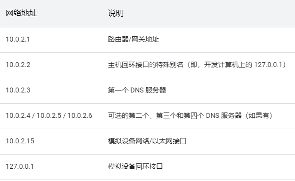
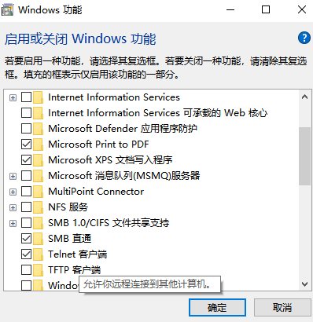
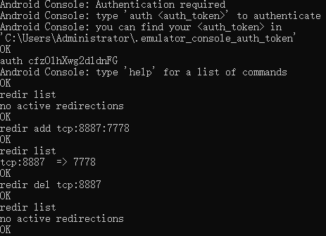

# 主机与安卓模拟器建立连接

## 1.服务器和客户端都在主机上或都在模拟器上

- 客户端都使用127.0.0.1

```java
new Socket("127.0.0.1", 9999);
```

## 2.主机：服务器，模拟器：客户端

- 客户端使用10.0.2.2，主机回环接口的特殊别名（即主机上的 127.0.0.1）

```java
new Socket("10.0.2.2", 9999);
```

## 3.主机：客户端，模拟器：服务器

- 访问网络只能从模拟器主动连接到主机，主机无法主动连接模拟器，除非使用网络重定向
- 模拟器网络地址



- 网络重定向


1. cmd打开主机的控制台
2. 输入命令连接到模拟器的控制台

```shell
telnet localhost 5554
```

telnet需要在控制面版->程序与功能->启用或关闭windows功能->勾选telnet



5554是模拟器端口号，可以在主机命令行中输入`adb devices` 看到。


3. 在模拟器控制台中输入命令进行身份验证

```shell
auth auth_token
```

`auth_token` 必须与主目录中 `.emulator_console_auth_token` 文件的内容相符。（tips：在模拟器控制台输入命令时，输入错误再改回正确的还是会KO: unknown command, try 'help'，应该按个回车再输命令）

4. 端口重定向

将主机上的端口 127.0.0.1:5000 的所有传入的 TCP 连接传递到模拟系统上的端口 10.0.2.15:6000

```shell
redir add tcp:5000:6000
```


或者使用adb设置端口转发

```shell
adb forward tcp:5000 tcp:6000
```

- 完整截图

主机控制台：


安卓模拟器控制台：

