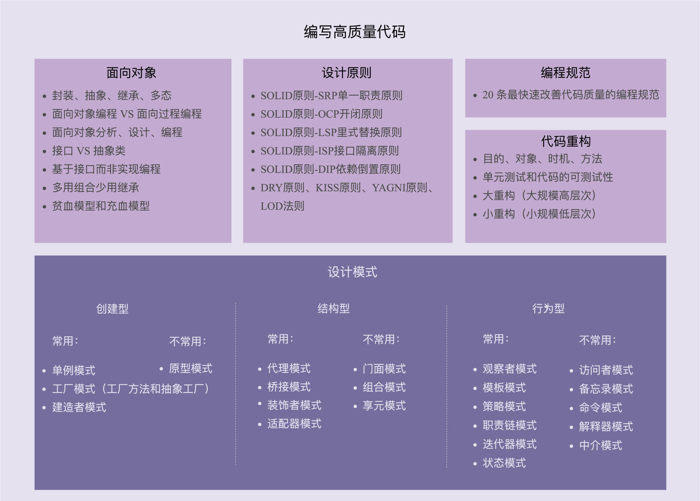

# 设计模式




## OOP七大原则

### 开闭原则

抽象约束、封装变化。对扩展开放，对修改关闭。

- 通过“抽象约束、封装变化”来实现开闭原则，即通过接口或者抽象类为软件实体定义一个相对稳定的抽象层，而将相同的可变因素封装在相同的具体实现类中。

### 里氏替换原则

子类可以扩展父类的功能，但不能改变父类原有的功能，尽量不要重写父类的方法。

- 子类可以实现父类的抽象方法，但不能覆盖父类的非抽象方法
- 子类中可以增加自己特有的方法
- 当子类的方法重载父类的方法时，方法的前置条件（即方法的输入参数）要比父类的方法更宽松
- 当子类的方法实现父类的方法时（重写/重载或实现抽象方法），方法的后置条件（即方法的的输出/返回值）要比父类的方法更严格或相等

### 依赖倒置原则

面向接口编程而不是面向实现编程，通过要面向接口的编程来降低类间的耦合性。

- 每个类尽量提供接口或抽象类，或者两者都具备。
- 变量的声明类型尽量是接口或者是抽象类。
- 任何类都不应该从具体类派生。
- 使用继承时尽量遵循里氏替换原则。
- 

### 单一职责原则

控制类的粒度大小，将对象解耦、提高内聚性。

- 接口尽量小，但是要有限度。一个接口只服务于一个子模块或业务逻辑。
- 为依赖接口的类定制服务。只提供调用者需要的方法，屏蔽不需要的方法。
- 了解环境，拒绝盲从。每个项目或产品都有选定的环境因素，环境不同，接口拆分的标准就不同深入了解业务逻辑。
- 提高内聚，减少对外交互。使接口用最少的方法去完成最多的事情。

- 接口隔离原则和单一职责都是为了提高类的内聚性、降低它们之间的耦合性，体现了封装的思想，但两者是不同的：
  - 单一职责原则注重的是职责，而接口隔离原则注重的是对接口依赖的隔离。
  - 单一职责原则主要是约束类，它针对的是程序中的实现和细节；接口隔离原则主要约束接口，主要针对抽象和程序整体框架的构建。

### 接口隔离原则

为各个类建立他们需要的专用接口

- 接口尽量小，但是要有限度。一个接口只服务于一个子模块或业务逻辑。
- 为依赖接口的类定制服务。只提供调用者需要的方法，屏蔽不需要的方法。
- 了解环境，拒绝盲从。每个项目或产品都有选定的环境因素，环境不同，接口拆分的标准就不同深入了解业务逻辑。
- 提高内聚，减少对外交互。使接口用最少的方法去完成最多的事情。

### 迪米特法则

只与你的直接朋友交谈，不和陌生人说话

- 在类的划分上，应该创建弱耦合的类。类与类之间的耦合越弱，就越有利于实现可复用的目标。
- 在类的结构设计上，尽量降低类成员的访问权限。
- 在类的设计上，优先考虑将一个类设置成不变类。
- 在对其他类的引用上，将引用其他对象的次数降到最低。
- 不暴露类的属性成员，而应该提供相应的访问器（set 和 get 方法）。
- 谨慎使用序列化（Serializable）功能。

### 合成复用原则

尽量先使用组合或者聚合等关联关系来实现，其次考虑使用继承关系实现

- 合成复用原则是通过将已有的对象纳入新对象中，作为新对象的成员对象来实现的，新对象可以调用已有对象的功能，从而达到复用。

### 总结

| 设计原则     | 一句话归纳                                                   | 目的                                       |
| ------------ | ------------------------------------------------------------ | ------------------------------------------ |
| 开闭原则     | 对扩展开放，对修改关闭                                       | 降低维护带来的新风险                       |
| 依赖倒置原则 | 高层不应该依赖低层，要面向接口编程                           | 更利于代码结构的升级扩展                   |
| 单一职责原则 | 一个类只干一件事，实现类要单一                               | 便于理解，提高代码的可读性                 |
| 接口隔离原则 | 一个接口只干一件事，接口要精简单一                           | 功能解耦，高聚合、低耦合                   |
| 迪米特法则   | 不该知道的不要知道，一个类应该保持对其它对象最少的了解，降低耦合度 | 只和朋友交流，不和陌生人说话，减少代码臃肿 |
| 里氏替换原则 | 不要破坏继承体系，子类重写方法功能发生改变，不应该影响父类方法的含义 | 防止继承泛滥                               |
| 合成复用原则 | 尽量使用组合或者聚合关系实现代码复用，少使用继承             | 降低代码耦合                               |

## 1.创建型模式

### 1.1单例模式


- **意图：**保证一个类仅有一个实例，并提供一个访问它的全局访问点。
- **主要解决：**一个全局使用的类频繁地创建与销毁。
- **何时使用：**当您想控制实例数目，节省系统资源的时候。
- **如何解决：**判断系统是否已经有这个单例，如果有则返回，如果没有则创建。
- **关键代码：**构造函数是私有的。
- **优点：**
  - 1、在内存里只有一个实例，减少了内存的开销，尤其是频繁的创建和销毁实例（比如管理学院首页页面缓存）。
  - 2、避免对资源的多重占用（比如写文件操作）。
- **缺点：**没有接口，不能继承，与单一职责原则冲突，一个类应该只关心内部逻辑，而不关心外面怎么样来实例化。
- **注意事项：**getInstance() 方法中需要使用同步锁 synchronized (Singleton.class) 防止多线程同时进入造成 instance 被多次实例化。

==构造器私有==

1. 单例类只有一个实例对象；
2. 该单例对象必须由单例类自行创建；
3. 单例类对外提供一个访问该单例的全局访问点。

单例模式的优点：

- 单例模式可以保证内存里只有一个实例，减少了内存的开销。
- 可以避免对资源的多重占用。
- 单例模式设置全局访问点，可以优化和共享资源的访问。

单例模式的缺点：

- 单例模式一般没有接口，扩展困难。如果要扩展，则除了修改原来的代码，没有第二种途径，违背开闭原则。

- 在并发测试中，单例模式不利于代码调试。在调试过程中，如果单例中的代码没有执行完，也不能模拟生成一个新的对象。

- 单例模式的功能代码通常写在一个类中，如果功能设计不合理，则很容易违背单一职责原则。

  单例模式的应用场景主要有以下几个方面。

  - 需要频繁创建的一些类，使用单例可以降低系统的内存压力，减少 GC。
  - 某类只要求生成一个对象的时候，如一个班中的班长、每个人的身份证号等。
  - 某些类创建实例时占用资源较多，或实例化耗时较长，且经常使用。
  - 某类需要频繁实例化，而创建的对象又频繁被销毁的时候，如多线程的线程池、网络连接池等。
  - 频繁访问数据库或文件的对象。
  - 对于一些控制硬件级别的操作，或者从系统上来讲应当是单一控制逻辑的操作，如果有多个实例，则系统会完全乱套。
  - 当对象需要被共享的场合。由于单例模式只允许创建一个对象，共享该对象可以节省内存，并加快对象访问速度。如 Web 中的配置对象、数据库的连接池等。

#### 饿汉模式

  - 一旦加载就创建一个单例，保证在调用 getInstance 方法之前单例已经存在了


```java
public class Hungry {

    //可能造成浪费空间
    private byte[] data1 = new byte[1024*1024];
    private byte[] data2 = new byte[1024*1024];
    private byte[] data3 = new byte[1024*1024];
    private byte[] data4 = new byte[1024*1024];

    private Hungry(){

    }

    // singleton作为类变量并且直接得到了初始化，即类中所有的变量都会被初始化。虽然可以实现多线程的唯一实例，但无法进行懒加载
    // 饿汉式单例在类创建的同时就已经创建好一个静态的对象供系统使用，以后不再改变，所以是线程安全的，可以直接用于多线程而不会出现问题。
    private final static Hungry HUNGRY = new Hungry();

    public static Hungry getInstance(){
        return HUNGRY;
    }
}
```

#### DCL懒汉模式

  - 类加载时没有生成单例，只有当第一次调用 getlnstance 方法时才去创建这个单例

```java
package singlePattern;

public class LazyMan {

    private LazyMan(){
        System.out.println("lazyMan");
    }

    // 避免new LazyMan()时指令重排（有可能实例对象的变量未完成实例化其他线程却获取到singleton变量）
    private static volatile LazyMan INSTANCE;

    /**
     * 在最开始，如果N个线程同时并发来获取实例，除了获取锁的线程之外其他的线程都阻塞在获取LazyMan.class的锁处。
     * 等待第一个线程初始化实例完成后，后面的N - 1线程会穿行执行synchronized代码块，
     * 如果代码块中没有判断singleton是否为null，则还是会再"new" N - 1 个实例出来。
     * @return
     */
    // DCL懒汉式 双重检测锁的懒汉式单例模式
    public static LazyMan getINSTANCE(){
        if (INSTANCE == null){
            synchronized (LazyMan.class) {
                // 确保类只有一个
                if (INSTANCE == null) {
                    INSTANCE = new LazyMan(); // 不是原子操作，需要加上volatile
                    /**
                     * 1.分配内存空间
                     * 2.执行构造方法，初始化对象
                     * 3.把这个对象指向这个空间
                     *
                     * 123
                     * 132 A
                     *     B//此时lazyMan还没有完成构造
                     *     必须加volatile
                     */
                }
            }
        }
        return INSTANCE;
    }

    public static void main(String[] args) {
        for (int i = 0; i < 10; i++) {
            new Thread(()->{
                LazyMan.getINSTANCE();
            }, "A").start();
        }
    }
}
```

#### 静态内部类

```java
// 静态内部类
public class OutClass {
    // 在Singleton类初始化并不会创建Singleton实例
    private OutClass(){}
    
    public static OutClass getInstance(){
        return InnerClass.INSTANCE;
    }
    
    public static class InnerClass{
        private static final OutClass INSTANCE = new OutClass();
    }
}
```

#### 用反射破坏

- 一个用getInstance创建，一个用反射创建

```java
package juc.single;

import java.lang.reflect.Constructor;
import java.lang.reflect.InvocationTargetException;

public class LazyMan {

    private LazyMan(){// 构造器私有
    }

    // 保证原子性操作
    private volatile static LazyMan lazyMan;

    // 双重检测锁模式的懒汉式单例 DCL懒汉式
    public static LazyMan getInstance(){
        if(lazyMan == null){
            synchronized (LazyMan.class){// 保证这个类只有一个
                if(lazyMan == null){
                    lazyMan = new LazyMan();// 不是原子性操作
                }
            }
        }
        return lazyMan;
    }

    public static void main(String[] args) throws NoSuchMethodException, IllegalAccessException, InvocationTargetException, InstantiationException {
        // 反射破坏单例
        LazyMan instance = LazyMan.getInstance();
        Constructor<LazyMan> declaredConstructor = LazyMan.class.getDeclaredConstructor();
        declaredConstructor.setAccessible(true);
        LazyMan instance2 = declaredConstructor.newInstance();

        System.out.println(instance);
        System.out.println(instance2);// 会有两个实例
    }
}
```

- 三重检测
  - 在构造函数里加锁，但是如果两个实例都是通过反射创建的就又不行了

```java
private LazyMan(){// 构造器私有
    synchronized (LazyMan.class){
        if (lazyMan!=null){
            throw new RuntimeException("不要用反射破坏单例模式");
        }
    }
}
```

- 加标志后又可以触发异常

```java
private static boolean flag = false;

private LazyMan(){// 构造器私有
    synchronized (LazyMan.class){
        if (flag == false){
            flag = true;
        } else {
            throw new RuntimeException("不要用反射破坏单例模式");
        }
    }
}
```

- 再用反射破环标志

```java
    public static void main(String[] args) throws NoSuchMethodException, IllegalAccessException, InvocationTargetException, InstantiationException, NoSuchFieldException {
        // 反射破坏单例
        Field flag = LazyMan.class.getDeclaredField("flag");
        flag.setAccessible(true);

//        LazyMan instance = LazyMan.getInstance();
        Constructor<LazyMan> declaredConstructor = LazyMan.class.getDeclaredConstructor();
        declaredConstructor.setAccessible(true);
        LazyMan instance = declaredConstructor.newInstance();

        flag.set(instance, false);

        LazyMan instance2 = declaredConstructor.newInstance();

        System.out.println(instance);
        System.out.println(instance2);
    }
```

#### 枚举不会被反射破坏

```java
package juc.single;

import java.lang.reflect.Constructor;
import java.lang.reflect.InvocationTargetException;

// 枚举本身就是一个类
public enum EnumSingle {
    INSTANCE;

    // 枚举类型不允许被继承，同样线程安全的，且只能被实例化一次。
    public EnumSingle getInstance(){
        return INSTANCE;
    }
}

class Test{
    public static void main(String[] args) throws NoSuchMethodException, IllegalAccessException, InvocationTargetException, InstantiationException {
        EnumSingle instance1 = EnumSingle.INSTANCE;
        Constructor<EnumSingle> declaredConstructor = EnumSingle.class.getDeclaredConstructor();
        declaredConstructor.setAccessible(true);
        EnumSingle instance2 = declaredConstructor.newInstance();

        System.out.println(instance1);
        System.out.println(instance2);

    }
}
```

- 枚举反编译的源码

```java
public final class EnumSingle extends Enum {

	public static EnumSingle[] values() {
		return (EnumSingle[])$VALUES.clone();
	}

	public static EnumSingle valueOf(String name) {
		return (EnumSingle)Enum.valueOf(juc/single/EnumSingle, name);
	}

	private EnumSingle(String s, int i) {
		super(s, i);
	}

	public EnumSingle getInstance() {
		return INSTANCE;
	}

	private static EnumSingle[] $values() {
		return (new EnumSingle[] {
		            INSTANCE
		        });
	}

	public static final EnumSingle INSTANCE = new EnumSingle("INSTANCE", 0);
	private static final EnumSingle $VALUES[] = $values();

}

```

#### 多例模式


### 1.2工厂模式

#### 静态工厂模式（简单工厂）


- 工厂模式的作用有下面4个，这也是判断要不要使用工厂模式最本质的参考标准。
  - 封装变化：创建逻辑有可能变化，封装成工厂类之后，创建逻辑的变更对调用者透明。
  - 代码复用：创建代码抽离到独立的工厂类之后可以复用。
  - 隔离复杂性：封装复杂的创建逻辑，调用者无需了解如何创建对象。
  - 控制复杂度：将创建代码抽离出来，让原本的函数或类职责更单一，代码更简洁。
- **意图：**定义一个创建对象的接口，让其子类自己决定实例化哪一个工厂类，工厂模式使其创建过程延迟到子类进行。
- **主要解决：**主要解决接口选择的问题。
- **何时使用：**我们明确地计划不同条件下创建不同实例时。
- **如何解决：**让其子类实现工厂接口，返回的也是一个抽象的产品。
- **关键代码：**创建过程在其子类执行。
- **优点：** 1、一个调用者想创建一个对象，只要知道其名称就可以了。 2、扩展性高，如果想增加一个产品，只要扩展一个工厂类就可以。 3、屏蔽产品的具体实现，调用者只关心产品的接口。
- **缺点：**每次增加一个产品时，都需要增加一个具体类和对象实现工厂，使得系统中类的个数成倍增加，在一定程度上增加了系统的复杂度，同时也增加了系统具体类的依赖。这并不是什么好事。
- **注意事项：**作为一种创建类模式，在任何需要生成复杂对象的地方，都可以使用工厂方法模式。有一点需要注意的地方就是复杂对象适合使用工厂模式，而简单对象，特别是只需要通过 new 就可以完成创建的对象，无需使用工厂模式。如果使用工厂模式，就需要引入一个工厂类，会增加系统的复杂度。
- 将调用者和实现类解耦
- 只有一个工厂
- 不满足开闭原则，有新的类时，必须扩展已有代码
- ==当每个对象的创建逻辑都比较简单的时候，我推荐使用简单工厂模式==

```java
package factorypattern;

public class FactoryPattern {
    public static void main(String[] args) {
        ShapeFactory.getShape("circle").draw();
        ShapeFactory.getShape("rectangle").draw();
        ShapeFactory.getShape("square").draw();
    }
}

interface Shape{
    void draw();
}

class Rectangle implements Shape{
    @Override
    public void draw() {
        System.out.println("Rectangle");
    }
}

class Square implements Shape {
    @Override
    public void draw() {
        System.out.println("Square");
    }
}

class Circle implements Shape{
    @Override
    public void draw() {
        System.out.println("Circle");
    }
}

// 简单工厂模式（静态工厂模式）
class ShapeFactory{
    public static Shape getShape(String shapeType){
        if (shapeType == null){
            return null;
        }
        if (shapeType.equalsIgnoreCase("CIRCLE")){
            return new Circle();
        }else if (shapeType.equalsIgnoreCase("RECTANGLE")){
            return new Rectangle();
        }else if (shapeType.equalsIgnoreCase("SQUARE")){
            return new Square();
        }
        return null;
    }
}
```

#### 工厂方法模式


- ==当每个对象的创建逻辑都比较复杂的时候，为了避免设计一个过于庞大的工厂类，我们推荐使用工厂方法模式，将创建逻辑拆分得更细，每个对象的创建逻辑独立到各自的工厂类中==。
- 每多一个类就要加一个工厂
- 不修改已有类的前提下，增加新的工厂实现扩展

```java
package factorypattern;

public class FactoryMethodPattern {
    public static void main(String[] args) {
        Car car1 = new SanlingFactory().getCar();
        Car car2 = new WulingFactory().getCar();

        car1.name();
        car2.name();
    }
}

interface Car{
    void name();
}

interface CarFactory{
    Car getCar();
}

class Sanling implements Car{
    @Override
    public void name() {
        System.out.println("三菱");
    }
}

class Wuling implements Car{
    @Override
    public void name() {
        System.out.println("五菱");
    }
}

class SanlingFactory implements CarFactory{
    @Override
    public Car getCar() {
        return new Sanling();
    }
}

class WulingFactory implements CarFactory{
    @Override
    public Car getCar() {
        return new Wuling();
    }
}
```

- 单列集合获取迭代器
  - Iterator是抽象产品类，ArrayList中的Itr类是具体产品类。Collection是抽象工厂类，ArrayList是具体工厂类。在具体工厂类里创建了具体产品，是工厂方法模式。
  - DataFormat类和Calendar类中的getInstance()都是工厂模式


### 1.3抽象工厂模式


- **意图：**提供一个创建一系列相关或相互依赖对象的接口，而无需指定它们具体的类。
- **主要解决：**主要解决接口选择的问题。
- **何时使用：**系统的产品有多于一个的产品族，而系统只消费其中某一族的产品。
- **如何解决：**在一个产品族里面，定义多个产品。
- **关键代码：**在一个工厂里聚合多个同类产品。
- **优点：**当一个产品族中的多个对象被设计成一起工作时，它能保证客户端始终只使用同一个产品族中的对象。
- **缺点：**产品族扩展非常困难，要增加一个系列的某一产品，既要在抽象的 Creator 里加代码，又要在具体的里面加代码。
- **注意事项：**产品族难扩展，产品等级易扩展。

- 围绕一个超级工厂创建其他工厂

```java
package designpattern;

public class demo2 {
    public static void main(String[] args) {
        FactoryProducer factoryProducer = new FactoryProducer();
        factoryProducer.getFactory("shape").getShape("circle").draw();

        factoryProducer.getFactory("color").getColor("red").fill();
    }
}

// 创建接口
interface Shape {
    void draw();
}
interface Color{
    void fill();
}

// 创建实现接口的实体类
class Rectangle implements Shape {

    @Override
    public void draw() {
        System.out.println("长方形");
    }
}
class Square implements Shape {

    @Override
    public void draw() {
        System.out.println("正方形");
    }
}
class Circle implements Shape {

    @Override
    public void draw() {
        System.out.println("圆形");
    }
}
class Red implements Color{
    @Override
    public void fill() {
        System.out.println("红色");
    }
}
class Green implements Color{
    @Override
    public void fill() {
        System.out.println("绿色");
    }
}
class Blue implements Color{
    @Override
    public void fill() {
        System.out.println("蓝色");
    }
}

// 创建抽象工厂类
abstract class AbstractFactory{
    public abstract Shape getShape(String shape);
    public abstract Color getColor(String color);
}

// 创建扩展了AbstractFactory的两个工厂类
class ShapeFactory extends AbstractFactory{
    @Override
    public Shape getShape(String shape) {
        if (shape == null){
            return null;
        }
        if (shape.equalsIgnoreCase("Rectangle")){
            return new Rectangle();
        } else if (shape.equalsIgnoreCase("Square")){
            return new Square();
        } else if (shape.equalsIgnoreCase("Circle")){
            return new Circle();
        }
        return null;
    }

    @Override
    public Color getColor(String color) {
        return null;
    }
}
class ColorFactory extends AbstractFactory{
    @Override
    public Shape getShape(String shape) {
        return null;
    }

    @Override
    public Color getColor(String color) {
        if (color == null){
            return null;
        }
        if (color.equalsIgnoreCase("RED")){
            return new Red();
        } else if (color.equalsIgnoreCase("GREEN")){
            return new Green();
        } else if (color.equalsIgnoreCase("BLUE")){
            return new Blue();
        }
        return null;
    }
}

// 创建一个工厂生成器类，通过传递形状或颜色信息来获取工厂
class FactoryProducer{
    public static AbstractFactory getFactory(String factory){
        if (factory.equalsIgnoreCase("SHAPE")){
            return new ShapeFactory();
        } else if (factory.equalsIgnoreCase("COLOR")){
            return new ColorFactory();
        }
        return null;
    }
}
```

### 1.4建造者模式


- **意图：**将一个复杂的构建与其表示相分离，使得同样的构建过程可以创建不同的表示。

- **主要解决：**主要解决在软件系统中，有时候面临着"一个复杂对象"的创建工作，其通常由各个部分的子对象用一定的算法构成；由于需求的变化，这个复杂对象的各个部分经常面临着剧烈的变化，但是将它们组合在一起的算法却相对稳定。

- **何时使用：**一些基本部件不会变，而其组合经常变化的时候。

- **如何解决：**将变与不变分离开。

- **关键代码：**建造者：创建和提供实例，导演：管理建造出来的实例的依赖关系。

- **优点：** 1、建造者独立，易扩展。 2、便于控制细节风险。

- **缺点：** 1、产品必须有共同点，范围有限制。 2、如内部变化复杂，会有很多的建造类。

- **使用场景：** 1、需要生成的对象具有复杂的内部结构。 2、需要生成的对象内部属性本身相互依赖。

- **注意事项：**与工厂模式的区别是：建造者模式更加关注与零件装配的顺序。

#### 常规方法

```java
package test;

public class Test {
    public static void main(String[] args) {
        Director director = new Director(new Worker()   );
        Product product = director.construct();
        System.out.println(product);
    }
}

// 产品类
class Product{
    private String partA;
    private String partB;
    private String partC;

    public void setPartA(String partA) {
        this.partA = partA;
    }

    public void setPartB(String partB) {
        this.partB = partB;
    }

    public void setPartC(String partC) {
        this.partC = partC;
    }
    

    @Override
    public String toString() {
        return "Product{" +
                "partA='" + partA + '\'' +
                ", partB='" + partB + '\'' +
                ", partC='" + partC + '\'' +
                '}';
    }
}

// 抽象的建造者
abstract class Builder{
    // 
    protected Product product = new Product();
    abstract void buildPartA();
    abstract void buildPartB();
    abstract void buildPartC();

    // 获得产品
    public Product getProduct() {
        return product;
    }
}

// 具体建造者
class Worker extends Builder{

    @Override
    void buildPartA() {
        product.setPartA("汉堡");
    }

    @Override
    void buildPartB() {
        product.setPartB("可乐");
    }

    @Override
    void buildPartC() {
        product.setPartC("鸡腿");
    }
}

// 指挥：负责构建工程
class Director{
    Builder builder;

    public Director(Builder builder) {
        this.builder = builder;
    }

    // 控制构建顺序
    public Product construct(){
        builder.buildPartB();
        builder.buildPartA();
        builder.buildPartC();
        return builder.getProduct();
    }
}
```


#### 静态内部类实现无序装配

- 没有指挥者：如果创建的产品种类只有一种，只需要一个具体建造者，这时可以省略掉抽象建造者，甚至可以省略掉指挥者角色。

```java
package test;

public class Test {
    public static void main(String[] args) {
        Builder builder = new Worker();
        Product product = builder.buildPartA("汉堡")
                .buildPartC("可乐")
                .buildPartB("薯条")
                .getProduct();
        System.out.println(product);
    }
}

// 产品类
class Product {
    private String partA;
    private String partB;
    private String partC;

    public void setPartA(String partA) {
        this.partA = partA;
    }

    public void setPartB(String partB) {
        this.partB = partB;
    }

    public void setPartC(String partC) {
        this.partC = partC;
    }


    @Override
    public String toString() {
        return "Product{" +
                "partA='" + partA + '\'' +
                ", partB='" + partB + '\'' +
                ", partC='" + partC + '\'' +
                '}';
    }
}

// 抽象的建造者
abstract class Builder {
    protected Product product = new Product();

    // 返回的都是Builder，才能链式装配
    abstract Builder buildPartA(String msg);

    abstract Builder buildPartB(String msg);

    abstract Builder buildPartC(String msg);

    // 获得产品
    public Product getProduct() {
        return product;
    }
}

// 具体建造者
class Worker extends Builder {
    
    @Override
    Builder buildPartA(String msg) {
        product.setPartA(msg);
        return this;
    }

    @Override
    Builder buildPartB(String msg) {
        product.setPartB(msg);
        return this;
    }

    @Override
    Builder buildPartC(String msg) {
        product.setPartC(msg);
        return this;
    }
}
```

### 1.5原型模式


- **意图：**用原型实例指定创建对象的种类，并且通过拷贝这些原型创建新的对象。
- **主要解决：**在运行期建立和删除原型。
- **何时使用：** 1、当一个系统应该独立于它的产品创建，构成和表示时。 2、当要实例化的类是在运行时刻指定时，例如，通过动态装载。 3、为了避免创建一个与产品类层次平行的工厂类层次时。 4、当一个类的实例只能有几个不同状态组合中的一种时。建立相应数目的原型并克隆它们可能比每次用合适的状态手工实例化该类更方便一些。
- **如何解决：**利用已有的一个原型对象，快速地生成和原型对象一样的实例。
- **关键代码：** 1、实现克隆操作，在 JAVA 继承 Cloneable，重写 clone()，在 .NET 中可以使用 Object 类的 MemberwiseClone() 方法来实现对象的浅拷贝或通过序列化的方式来实现深拷贝。 2、原型模式同样用于隔离类对象的使用者和具体类型（易变类）之间的耦合关系，它同样要求这些"易变类"拥有稳定的接口。
- **优点：** 1、性能提高。 2、逃避构造函数的约束。
- **缺点：** 1、配备克隆方法需要对类的功能进行通盘考虑，这对于全新的类不是很难，但对于已有的类不一定很容易，特别当一个类引用不支持串行化的间接对象，或者引用含有循环结构的时候。 2、必须实现 Cloneable 接口。
- **注意事项：**与通过对一个类进行实例化来构造新对象不同的是，原型模式是通过拷贝一个现有对象生成新对象的。浅拷贝实现 Cloneable，重写，深拷贝是通过实现 Serializable 读取二进制流。

#### 浅拷贝

- 创建一个新对象，新对象的属性和原来对象完全相同，对于非基本类型属性，仍指向原有属性所指向的对象的内存地址。

- Video.java

```java
package prototypepattern;

import java.util.Date;

public class Video implements Cloneable{
    private String name;
    private Date createTime;

    @Override
    protected Object clone() throws CloneNotSupportedException {
        return super.clone();
    }

    public Video() {
    }

    public Video(String name, Date createTime) {
        this.name = name;
        this.createTime = createTime;
    }

    public String getName() {
        return name;
    }

    public void setName(String name) {
        this.name = name;
    }

    public Date getCreateTime() {
        return createTime;
    }

    public void setCreateTime(Date createTime) {
        this.createTime = createTime;
    }

    @Override
    public String toString() {
        return "Video{" +
                "name='" + name + '\'' +
                ", createTime=" + createTime +
                '}';
    }
}
```

- PrototypePattern.java

```java
package prototypepattern;

import java.util.Date;

public class PrototypePattern {
    public static void main(String[] args) throws CloneNotSupportedException {
        // 原型对象
        Date date = new Date();
        Video v1 = new Video("视频1", date);
        System.out.println(v1);
        System.out.println(v1.hashCode());

        // 浅克隆 v1,v2共用一个Date
        Video v2 = (Video) v1.clone();
        System.out.println(v2);
        System.out.println(v2.hashCode());

        // 修改v1的Date值，v2的也会改变
        date.setTime(2134561231);
        System.out.println(v1);
        System.out.println(v2);
    }
}
```

#### 深拷贝

- 创建一个新对象，属性中引用的其他对象也会被克隆，不再指向原有对象地址。

- 重写clone()方法

```java
@Override
protected Object clone() throws CloneNotSupportedException {
    Object object = super.clone();
    Video video = (Video) object;

    // 把对象的属性也克隆
    video.createTime = (Date) this.createTime.clone();
    return object;
}
```


## 2.结构型模式

### 2.1适配器模式

- **意图：**将一个类的接口转换成客户希望的另外一个接口。适配器模式使得原本由于接口不兼容而不能一起工作的那些类可以一起工作。

- **主要解决：**主要解决在软件系统中，常常要将一些"现存的对象"放到新的环境中，而新环境要求的接口是现对象不能满足的。

- **何时使用：** 1、系统需要使用现有的类，而此类的接口不符合系统的需要。 2、想要建立一个可以重复使用的类，用于与一些彼此之间没有太大关联的一些类，包括一些可能在将来引进的类一起工作，这些源类不一定有一致的接口。 3、通过接口转换，将一个类插入另一个类系中。（比如老虎和飞禽，现在多了一个飞虎，在不增加实体的需求下，增加一个适配器，在里面包容一个虎对象，实现飞的接口。）

- **如何解决：**继承或依赖（推荐）。

- **关键代码：**适配器继承或依赖已有的对象，实现想要的目标接口。
- **优点：** 1、可以让任何两个没有关联的类一起运行。 2、提高了类的复用。 3、增加了类的透明度。 4、灵活性好。
- **缺点：** 1、过多地使用适配器，会让系统非常零乱，不易整体进行把握。比如，明明看到调用的是 A 接口，其实内部被适配成了 B 接口的实现，一个系统如果太多出现这种情况，无异于一场灾难。因此如果不是很有必要，可以不使用适配器，而是直接对系统进行重构。 2.由于 JAVA 至多继承一个类，所以至多只能适配一个适配者类，而且目标类必须是抽象类。
- **注意事项：**==适配器不是在详细设计时添加的，而是解决正在服役的项目的问题==。

#### 类适配器模式

- 用泛化关系


```java
package adapterpattern;

// 目标接口:当前系统业务所期待的接口，它可以是抽象类或接口。
interface Target {
    void request();
}

// 适配者接口:它是被访问和适配的现存组件库中的组件接口。
class Adaptee {
    public void specificRequest() {
        System.out.println("适配者中的业务代码被调用！");
    }
}

// 类适配器类:：它是一个转换器，通过继承或引用适配者的对象，把适配者接口转换成目标接口，让客户按目标接口的格式访问适配者。
class ClassAdapter extends Adaptee implements Target {
    public void request() {
        specificRequest();
    }
}

// 客户端代码
public class AdapterTest {
    public static void main(String[] args) {
        Target target = new ClassAdapter();
        target.request();
    }
}
```


#### 对象适配器模式

- 用组合关系


```java
//对象适配器类
class ObjectAdapter implements Target {
    // 聚合
    private Adaptee adaptee;

    public ObjectAdapter(Adaptee adaptee) {
        this.adaptee = adaptee;
    }

    public void request() {
        adaptee.specificRequest();
    }
}

//客户端代码
class ObjectAdapterTest {
    public static void main(String[] args) {
        Adaptee adaptee = new Adaptee();
        Target target = new ObjectAdapter(adaptee);
        target.request();
    }
}
```

### 2.2桥接模式


- **意图：**将抽象部分与实现部分分离，使它们都可以独立的变化。

- **主要解决：**在有多种可能会变化的情况下，用继承会造成类爆炸问题，扩展起来不灵活。

- **何时使用：**实现系统可能有多个角度分类，每一种角度都可能变化。

- **如何解决：**把这种多角度分类分离出来，让它们独立变化，减少它们之间耦合。

- **关键代码：**抽象类依赖实现类。它是用组合关系代替继承关系来实现，从而降低了抽象和实现这两个可变维度的耦合度。
- **优点：** 1、抽象和实现的分离。 2、优秀的扩展能力。 3、实现细节对客户透明。
- **缺点：**桥接模式的引入会增加系统的理解与设计难度，由于聚合关联关系建立在抽象层，要求开发者针对抽象进行设计与编程。
- **注意事项：**对于两个独立变化的维度，使用桥接模式再适合不过了。

```java
// 品牌
interface Brand {
    void info();
}
public class Lenovo implements Brand{
    @Override
    public void info() {
        System.out.println("联想");
    }
}
public class Apple implements Brand {
    @Override
    public void info() {
        System.out.println("苹果");
    }
}

// 抽象化角色
public abstract class Computer {
    // 用组合而不是继承
    protected Brand brand;

    public Computer(Brand brand) {
        this.brand = brand;
    }

    public abstract void info();
}
// 扩展抽象化角色
class Desktop extends Computer{

    public void info() {
        brand.info();
        System.out.println("台式机");
    }

    public Desktop(Brand brand) {
        super(brand);
    }
}
// 扩展抽象化角色
class Laptop extends Computer{

    public void info() {
        brand.info();
        System.out.println("笔记本");
    }

    public Laptop(Brand brand) {
        super(brand);
    }
}

public class Test {
    public static void main(String[] args) {
        // 苹果笔记本
        Computer computer = new Laptop(new Apple());
        computer.info();
        // 联想台式机
        Computer computer1 = new Desktop(new Lenovo());
        computer1.info();
    }
}
```


### 2.3代理模式


- **意图：**为其他对象提供一种代理以控制对这个对象的访问。
- **主要解决：**在直接访问对象时带来的问题，比如说：要访问的对象在远程的机器上。在面向对象系统中，有些对象由于某些原因（比如对象创建开销很大，或者某些操作需要安全控制，或者需要进程外的访问），直接访问会给使用者或者系统结构带来很多麻烦，我们可以在访问此对象时加上一个对此对象的访问层。
- **何时使用：**想在访问一个类时做一些控制。
- **如何解决：**增加中间层。
- **关键代码：**实现与被代理类组合。
- **优点：** 1、职责清晰。 2、高扩展性。 3、智能化。
- **缺点：** 1、由于在客户端和真实主题之间增加了代理对象，因此有些类型的代理模式可能会造成请求的处理速度变慢。 2、实现代理模式需要额外的工作，有些代理模式的实现非常复杂。
- **注意事项：** 1、和适配器模式的区别：适配器模式主要改变所考虑对象的接口，而代理模式不能改变所代理类的接口。 2、和装饰器模式的区别：装饰器模式为了增强功能，而代理模式是为了加以控制。
- 根据代理的创建时期，代理模式分为静态代理和动态代理。
  - 静态：由程序员创建代理类或特定工具自动生成源代码再对其编译，在程序运行前代理类的 .class 文件就已经存在了。
  - 动态：在程序运行时，运用反射机制动态创建而成。代理的是一个接口，可以代理多个类（实现同一个接口）。
#### 静态代理


```java
package proxypattern;

public class StaticProxy {
    public static void main(String[] args) {
        You you = new You();
        WeddingCompany weddingCompany = new WeddingCompany(you);
        weddingCompany.HappyMarry(); // 代理真实对象you

        new Thread(()-> System.out.println("haha")).start();
    }
}

interface Marry{
    void HappyMarry();
}

// 真实对象
class You implements Marry{

    @Override
    public void HappyMarry() {
        System.out.println("marry!");
    }
}

// 代理对象
class WeddingCompany implements Marry{

    private Marry target; // 要代理的对象

    public WeddingCompany(Marry target) {
        this.target = target;
    }

    @Override
    public void HappyMarry() {
        before();
        target.HappyMarry();
        after();
    }

    public void before(){
        System.out.println("准备工作");
    }

    public void after(){
        System.out.println("事后工作");
    }
}
```

#### 动态代理


- 两大类的动态代理
  - 基于接口：JDK动态代理
  - 基于类：CGLIB动态代理
  - java字节码实现：javasist

```java
import java.lang.reflect.InvocationHandler;
import java.lang.reflect.Method;
import java.lang.reflect.Proxy;

public class Client {
    public static void main(String[] args) {
        // 真实角色
        You you = new You();
        // 设置要代理的对象
        ProxyInvocationHandler handler = new ProxyInvocationHandler();
        handler.setTarget(you);
        // 动态生成代理角色
        Marry proxy = (Marry) handler.getProxy();
        proxy.marry();
    }
}

interface Marry {
    void marry();
}
class You implements Marry{
    @Override
    public void marry() {
        System.out.println("marrying");
    }
}

// 用这个类自动生成代理类
class ProxyInvocationHandler implements InvocationHandler{
    // 被代理的对象
    Object target;

    public void setTarget(Object target) {
        this.target = target;
    }

    // 生成得到代理类
    public Object getProxy(){
        return Proxy.newProxyInstance(this.getClass().getClassLoader(),
                target.getClass().getInterfaces(),
                this);
    }

    // 处理代理实例，并返回结果
    @Override
    public Object invoke(Object proxy, Method method, Object[] args) throws Throwable {
        System.out.println("before");
        // 反射
        Object result = method.invoke(target, args);
        System.out.println("after");
        return result;
    }
}
```

### 2.4 装饰模式


- **意图：**动态地给一个对象添加一些额外的职责。就增加功能来说，装饰器模式相比生成子类更为灵活。使用组合关系来创建一个包装对象（即装饰对象）来包裹真实对象，并在保持真实对象的类结构不变的前提下，为其提供额外的功能，这就是装饰器模式的目标。

- **主要解决：**一般的，我们为了扩展一个类经常使用继承方式实现，由于继承为类引入静态特征，并且随着扩展功能的增多，子类会很膨胀。

- **何时使用：**在不想增加很多子类的情况下扩展类。

- **如何解决：**将具体功能职责划分，同时继承装饰者模式。

- **关键代码：** 1、Component 类充当抽象角色，不应该具体实现。 2、修饰类引用和继承 Component 类，具体扩展类重写父类方法。

- **优点：**装饰类和被装饰类可以独立发展，不会相互耦合，装饰模式是继承的一个替代模式，装饰模式可以动态扩展一个实现类的功能。

- **缺点：**多层装饰比较复杂。

- **注意事项：**可代替继承。

```java
package decoratorpattern;

public class DecoratorPattern {
    public static void main(String[] args) {
        Component p = new ConcreteComponent();
        p.operation();
        System.out.println("---------------------------------");
        Component d = new ConcreteDecorator(p);
        d.operation();
    }
}

// 抽象构件角色:定义一个抽象接口以规范准备接收附加责任的对象。
interface Component {
    void operation();
}

// 具体构件角色:实现抽象构件，通过装饰角色为其添加一些职责。
class ConcreteComponent implements Component {
    public ConcreteComponent() {
        System.out.println("创建具体构件角色");
    }
    
    @Override
    public void operation() {
        System.out.println("调用具体构件角色的方法operation()");
    }
}

// 抽象装饰角色:继承抽象构件，并包含具体构件的实例，可以通过其子类扩展具体构件的功能。
class Decorator implements Component {
    private Component component;

    public Decorator(Component component) {
        this.component = component;
    }

    @Override
    public void operation() {
        component.operation();
    }
}

// 具体装饰角色:实现抽象装饰的相关方法，并给具体构件对象添加附加的责任。
class ConcreteDecorator extends Decorator {
    public ConcreteDecorator(Component component) {
        super(component);
    }

    @Override
    public void operation() {
        super.operation();
        // 新加的功能
        addedFunction();
    }

    public void addedFunction() {
        System.out.println("为具体构件角色增加额外的功能addedFunction()");
    }
}
```

### 2.5享元模式


- 类图说明
  - UnsharedConcreteFlyweight 是非享元角色，里面包含了非共享的外部状态信息 info；
  - Flyweight 是抽象享元角色，里面包含了享元方法 operation(UnsharedConcreteFlyweight state)，非享元的外部状态以参数的形式通过该方法传入；
  - ConcreteFlyweight 是具体享元角色，包含了关键字 key，它实现了抽象享元接口；
  - FlyweightFactory 是享元工厂角色，它是关键字 key 来管理具体享元；
  - 客户角色通过享元工厂获取具体享元，并访问具体享元的相关方法。

- **意图：**运用共享技术有效地支持大量细粒度的对象。

- **主要解决：**在有大量对象时，有可能会造成内存溢出，我们把其中共同的部分抽象出来，如果有相同的业务请求，直接返回在内存中已有的对象，避免重新创建。

- **何时使用：** 1、系统中有大量对象。 2、这些对象消耗大量内存。 3、这些对象的状态大部分可以外部化。 4、这些对象可以按照内蕴状态分为很多组，当把外蕴对象从对象中剔除出来时，每一组对象都可以用一个对象来代替。 5、系统不依赖于这些对象身份，这些对象是不可分辨的。

- **如何解决：**用唯一标识码判断，如果在内存中有，则返回这个唯一标识码所标识的对象。

- **关键代码：**用 HashMap 存储这些对象。享元模式的本质是缓存共享对象，降低内存消耗。

- **优点：**相同对象只要保存一份，这降低了系统中对象的数量，从而降低了系统中细粒度对象给内存带来的压力。

- **缺点：**提高了系统的复杂度，需要分离出外部状态和内部状态，而且外部状态具有固有化的性质，不应该随着内部状态的变化而变化，否则会造成系统的混乱。

- **注意事项：** 1、注意划分外部状态和内部状态，否则可能会引起线程安全问题。 2、这些类必须有一个工厂对象加以控制。

```java
package flyweightpattern;

import java.util.HashMap;

public class FlyweightPattern {
    public static void main(String[] args) {
        FlyweightFactory factory = new FlyweightFactory();
        Flyweight f01 = factory.getFlyweight("a");
        Flyweight f02 = factory.getFlyweight("a");
        Flyweight f03 = factory.getFlyweight("a");
        Flyweight f11 = factory.getFlyweight("b");
        Flyweight f12 = factory.getFlyweight("b");
        f01.operation(new UnsharedConcreteFlyweight("第1次调用a。"));
        f02.operation(new UnsharedConcreteFlyweight("第2次调用a。"));
        f03.operation(new UnsharedConcreteFlyweight("第3次调用a。"));
        f11.operation(new UnsharedConcreteFlyweight("第1次调用b。"));
        f12.operation(new UnsharedConcreteFlyweight("第2次调用b。"));
    }
}

// 抽象享元角色:是所有的具体享元类的基类，为具体享元规范需要实现的公共接口。
interface Flyweight {
    // 非享元的外部状态以参数的形式通过方法传入
    void operation(UnsharedConcreteFlyweight state);
}

// 具体享元角色:实现抽象享元角色中所规定的接口。
class ConcreteFlyweight implements Flyweight {
    private String key;

    ConcreteFlyweight(String key) {
        this.key = key;
        System.out.println("具体享元" + key + "被创建！");
    }

    @Override
    public void operation(UnsharedConcreteFlyweight outState) {
        System.out.print("具体享元" + key + "被调用，");
        System.out.println("非享元信息是:" + outState.getInfo());
    }
}

// 非享元角色:是不可以共享的外部状态，它以参数的形式注入具体享元的相关方法中。
class UnsharedConcreteFlyweight {
    // 非共享的外部状态信息
    private String info;

    UnsharedConcreteFlyweight(String info) {
        this.info = info;
    }

    public String getInfo() {
        return info;
    }

    public void setInfo(String info) {
        this.info = info;
    }
}

// 享元工厂角色:负责创建和管理享元角色。
class FlyweightFactory {
    private HashMap<String, Flyweight> flyweights = new HashMap<>();

    // 用key管理具体享元
    // 当客户对象请求一个享元对象时，享元工厂检査系统中是否存在符合要求的享元对象
    public Flyweight getFlyweight(String key) {
        Flyweight flyweight = flyweights.get(key);
        if (flyweight != null) {
            // 如果存在则提供给客户
            System.out.println("具体享元" + key + "已经存在，被成功获取！");
        } else {
            // 如果不存在的话，则创建一个新的享元对象
            flyweight = new ConcreteFlyweight(key);
            flyweights.put(key, flyweight);
        }
        return flyweight;
    }
}
```

### 2.6外观模式


- **意图：**为子系统中的一组接口提供一个一致的界面，外观模式定义了一个高层接口，这个接口使得这一子系统更加容易使用。

- **主要解决：**降低访问复杂系统的内部子系统时的复杂度，简化客户端之间的接口。

- **何时使用：** 1、客户端不需要知道系统内部的复杂联系，整个系统只需提供一个"接待员"即可。 2、定义系统的入口。

- **如何解决：**客户端不与系统耦合，外观类与系统耦合。

- **关键代码：**在客户端和复杂系统之间再加一层，这一层将调用顺序、依赖关系等处理好。

- **优点：** 1、减少系统相互依赖。 2、提高灵活性。 3、提高了安全性。

- **缺点：**不符合开闭原则，如果要改东西很麻烦，继承重写都不合适。

- **注意事项：**在层次化结构中，可以使用外观模式定义系统中每一层的入口。

```java
package facadepattern;

public class FacadePattern {
    public static void main(String[] args) {
        // 通过一个外观角色访问各个子系统的功能。
        Facade f = new Facade();
        f.method();
    }
}

// 外观角色:为多个子系统对外提供一个共同的接口。
class Facade {
    private SubSystem01 obj1 = new SubSystem01();
    private SubSystem02 obj2 = new SubSystem02();
    private SubSystem03 obj3 = new SubSystem03();
    public void method() {
        obj1.method1();
        obj2.method2();
        obj3.method3();
    }
}

// 子系统角色:实现系统的部分功能，客户可以通过外观角色访问它。
class SubSystem01 {
    public void method1() {
        System.out.println("子系统01的method1()被调用！");
    }
}

// 子系统角色
class SubSystem02 {
    public void method2() {
        System.out.println("子系统02的method2()被调用！");
    }
}

// 子系统角色
class SubSystem03 {
    public void method3() {
        System.out.println("子系统03的method3()被调用！");
    }
}
```

### 2.7组合模式

- **意图：**将对象组合成树形结构以表示"部分-整体"的层次结构。组合模式使得用户对单个对象和组合对象的使用具有一致性。

- **主要解决：**它在我们树型结构的问题中，模糊了简单元素和复杂元素的概念，客户程序可以像处理简单元素一样来处理复杂元素，从而使得客户程序与复杂元素的内部结构解耦。

- **何时使用：** 1、您想表示对象的部分-整体层次结构（树形结构）。 2、您希望用户忽略组合对象与单个对象的不同，用户将统一地使用组合结构中的所有对象。

- **如何解决：**树枝和叶子实现统一接口，树枝内部组合该接口。

- **关键代码：**树枝内部组合该接口，并且含有内部属性 List，里面放 Component。

- **优点：** 1、高层模块调用简单。 2、节点自由增加。

- **缺点：**在使用组合模式时，其叶子和树枝的声明都是实现类，而不是接口，违反了依赖倒置原则。

- **注意事项：**定义时为具体类。

#### 透明方式

- 在该方式中，由于抽象构件声明了所有子类中的全部方法，所以客户端无须区别树叶对象和树枝对象，对客户端来说是透明的。但其缺点是：树叶构件本来没有 Add()、Remove() 及 GetChild() 方法，却要实现它们（空实现或抛异常），这样会带来一些安全性问题。


- 访问集合 c0={leaf1,{leaf2,leaf3}} 中的元素


```java
package compositepattern;

import java.util.ArrayList;

public class CompositePattern {
    public static void main(String[] args) {
        // 访问集合 c0={leaf1,{leaf2,leaf3}} 中的元素
        Component c0 = new Composite();
        Component c1 = new Composite();
        Component leaf1 = new Leaf("1");
        Component leaf2 = new Leaf("2");
        Component leaf3 = new Leaf("3");
        c0.add(leaf1);
        c0.add(c1);
        c1.add(leaf2);
        c1.add(leaf3);
        c0.operation();
    }
}

// 抽象构件:它的主要作用是为树叶构件和树枝构件声明公共接口，并实现它们的默认行为。
// 在透明式的组合模式中抽象构件还声明访问和管理子类的接口；
// 在安全式的组合模式中不声明访问和管理子类的接口，管理工作由树枝构件完成。（总的抽象类或接口，定义一些通用的方法，比如新增、删除）
interface Component {
    void add(Component c);
    void remove(Component c);
    Component getChild(int i);
    void operation();
}

// 树叶构件:是组合中的叶节点对象，它没有子节点，用于继承或实现抽象构件。
class Leaf implements Component {
    private String name;
    public Leaf(String name) {
        this.name = name;
    }
    // 树叶构件本来没有 Add()、Remove() 及 GetChild() 方法，却要实现它们（空实现或抛异常）
    @Override
    public void add(Component c) {
    }
    @Override
    public void remove(Component c) {
    }
    @Override
    public Component getChild(int i) {
        return null;
    }
    
    @Override
    public void operation() {
        System.out.println("树叶" + name + "：被访问！");
    }
}

// 树枝构件:是组合中的分支节点对象，它有子节点，用于继承和实现抽象构件。
// 它的主要作用是存储和管理子部件，通常包含 Add()、Remove()、GetChild() 等方法。
class Composite implements Component {
    private ArrayList<Component> children = new ArrayList<>();
    @Override
    public void add(Component c) {
        children.add(c);
    }
    @Override
    public void remove(Component c) {
        children.remove(c);
    }
    @Override
    public Component getChild(int i) {
        return children.get(i);
    }
    @Override
    public void operation() {
        for (Object obj : children) {
            ((Component) obj).operation();
        }
    }
}
```

#### 安全方式

在该方式中，将管理子构件的方法移到树枝构件中，抽象构件和树叶构件没有对子对象的管理方法，这样就避免了上一种方式的安全性问题，但由于叶子和分支有不同的接口，客户端在调用时要知道树叶对象和树枝对象的存在，所以失去了透明性。


```java
package compositepattern;

import java.util.ArrayList;

public class CompositePattern {
    public static void main(String[] args) {
        // 访问集合 c0={leaf1,{leaf2,leaf3}} 中的元素
        Composite c0 = new Composite();
        Composite c1 = new Composite();
        Component leaf1 = new Leaf("1");
        Component leaf2 = new Leaf("2");
        Component leaf3 = new Leaf("3");
        c0.add(leaf1);
        c0.add(c1);
        c1.add(leaf2);
        c1.add(leaf3);
        c0.operation();
    }
}

// 抽象构件
interface Component {
    void operation();
}

// 树叶构件
class Leaf implements Component {
    private String name;
    public Leaf(String name) {
        this.name = name;
    }
    @Override
    public void operation() {
        System.out.println("树叶" + name + "：被访问！");
    }
}

// 树枝构件
class Composite implements Component {
    private ArrayList<Component> children = new ArrayList<>();

    public void add(Component c) {
        children.add(c);
    }

    public void remove(Component c) {
        children.remove(c);
    }

    public Component getChild(int i) {
        return children.get(i);
    }
    @Override
    public void operation() {
        for (Object obj : children) {
            ((Component) obj).operation();
        }
    }
}
```


## 3.行为型模式

### 3.1观察者模式


- **意图：**定义对象间的一种一对多的依赖关系，当一个对象的状态发生改变时，所有依赖于它的对象都得到通知并被自动更新。
- **主要解决：**一个对象状态改变给其他对象通知的问题，而且要考虑到易用和低耦合，保证高度的协作。
- **何时使用：**一个对象（目标对象）的状态发生改变，所有的依赖对象（观察者对象）都将得到通知，进行广播通知。
- **如何解决：**使用面向对象技术，可以将这种依赖关系弱化。
- **关键代码：**在抽象类里有一个 ArrayList 存放观察者们。
- **优点：** 1、观察者和被观察者是抽象耦合的。 2、建立一套触发机制。
- **缺点：** 1、如果一个被观察者对象有很多的直接和间接的观察者的话，将所有的观察者都通知到会花费很多时间。 2、如果在观察者和观察目标之间有循环依赖的话，观察目标会触发它们之间进行循环调用，可能导致系统崩溃。 3、观察者模式没有相应的机制让观察者知道所观察的目标对象是怎么发生变化的，而仅仅只是知道观察目标发生了变化。
- **注意事项：** 1、JAVA 中已经有了对观察者模式的支持类。 2、避免循环引用。 3、如果顺序执行，某一观察者错误会导致系统卡壳，一般采用异步方式。

```java
package observerPattern;

import java.util.ArrayList;
import java.util.List;

public class ObserverPattern {
    public static void main(String[] args) {
        Subject subject = new ConcreteSubject();
        Observer obs1 = new ConcreteObserver1();
        Observer obs2 = new ConcreteObserver2();
        subject.add(obs1);
        subject.add(obs2);
        subject.notifyObserver();
    }
}

// 抽象目标
abstract class Subject {
    protected List<Observer> observers = new ArrayList<>();
    // 增加观察者方法
    public void add(Observer observer) {
        observers.add(observer);
    }
    // 删除观察者方法
    public void remove(Observer observer) {
        observers.remove(observer);
    }
    public abstract void notifyObserver(); //通知观察者方法
}

// 具体目标
class ConcreteSubject extends Subject {
    public void notifyObserver() {
        System.out.println("具体目标发生改变...");
        System.out.println("--------------");
        for (Observer obs : observers) {
            obs.response();
        }
    }
}

// 抽象观察者
interface Observer {
    void response(); //反应
}

// 具体观察者1
class ConcreteObserver1 implements Observer {
    public void response() {
        System.out.println("具体观察者1作出反应！");
    }
}

// 具体观察者1
class ConcreteObserver2 implements Observer {
    public void response() {
        System.out.println("具体观察者2作出反应！");
    }
}
```

---

```java
import java.util.ArrayList;
import java.util.List;

public class ObserverPattern {
    public static void main(String[] args) {
        Debit zhangSan = new ZhangSan();
        zhangSan.borrowMoney(new LiSi());
        zhangSan.borrowMoney(new WangWu());

        zhangSan.notifyCredits();

    }
}

// 借款方
interface Debit{
    void borrowMoney(Credit credit); // 借钱 添加观察者
    void notifyCredits(); // 提醒贷款方收钱    通知观察者
}

// 贷款方
interface Credit{
    void takeMoney();
}

class ZhangSan implements Debit{
    private List<Credit> allCredits = new ArrayList<>();
    private Boolean hasMoney = false; // 是否有钱

    @Override
    public void borrowMoney(Credit credit) {
        // 主题对象添加观察者
        allCredits.add(credit);
    }

    @Override
    public void notifyCredits() {
        allCredits.forEach(credit -> credit.takeMoney());
    }
}

class LiSi implements Credit{

    @Override
    public void takeMoney() {
        System.out.println("lisi");
    }
}

class WangWu implements Credit{

    @Override
    public void takeMoney() {
        System.out.println("wangwu");
    }
}
```

### 3.2策略模式


- **意图：**定义一系列的算法,把它们一个个封装起来, 并且使它们可相互替换。

- **主要解决：**在有多种算法相似的情况下，使用 if...else 所带来的复杂和难以维护。

- **何时使用：**一个系统有许多许多类，而区分它们的只是他们直接的行为。

- **如何解决：**将这些算法封装成一个一个的类，任意地替换。

- **关键代码：**实现同一个接口。

- **优点：** 1、算法可以自由切换。 2、避免使用多重条件判断。 3、扩展性良好。

- **缺点：** 1、策略类会增多。 2、所有策略类都需要对外暴露。

- **注意事项：**如果一个系统的策略多于四个，就需要考虑使用混合模式，解决策略类膨胀的问题。

```java
package strategypattern;

public class StrategyPattern {
    public static void main(String[] args) {
        Context c = new Context();

        Strategy s = new ConcreteStrategyA();
        c.setStrategy(s);
        c.strategyMethod();

        s = new ConcreteStrategyB();
        c.setStrategy(s);
        c.strategyMethod();
    }
}
// 抽象策略类:定义了一个公共接口，各种不同的算法以不同的方式实现这个接口，环境角色使用这个接口调用不同的算法，一般使用接口或抽象类实现。
interface Strategy {
    void strategyMethod();    //策略方法
}

// 具体策略类A
class ConcreteStrategyA implements Strategy {
    public void strategyMethod() {
        System.out.println("具体策略A的策略方法被访问！");
    }
}

// 具体策略类B
class ConcreteStrategyB implements Strategy {
    public void strategyMethod() {
        System.out.println("具体策略B的策略方法被访问！");
    }
}

// 环境类:持有一个策略类的引用，最终给客户端调用。
class Context {
    private Strategy strategy;
    public Strategy getStrategy() {
        return strategy;
    }
    public void setStrategy(Strategy strategy) {
        this.strategy = strategy;
    }
    public void strategyMethod() {
        strategy.strategyMethod();
    }
}
```

### 3.3命令模式


- **意图：**将一个请求封装成一个对象，从而使您可以用不同的请求对客户进行参数化。

- **主要解决：**在软件系统中，行为请求者与行为实现者通常是一种紧耦合的关系，但某些场合，比如需要对行为进行记录、撤销或重做、事务等处理时，这种无法抵御变化的紧耦合的设计就不太合适。

- **何时使用：**在某些场合，比如要对行为进行"记录、撤销/重做、事务"等处理，这种无法抵御变化的紧耦合是不合适的。在这种情况下，如何将"行为请求者"与"行为实现者"解耦？将一组行为抽象为对象，可以实现二者之间的松耦合。

- **如何解决：**通过调用者调用接受者执行命令，顺序：调用者→命令→接受者。

- **关键代码：**定义三个角色：1、received 真正的命令执行对象 2、Command 3、invoker 使用命令对象的入口

- **优点：** 1、降低了系统耦合度。 2、新的命令可以很容易添加到系统中去。

- **缺点：**使用命令模式可能会导致某些系统有过多的具体命令类。

- **注意事项：**系统需要支持命令的撤销(Undo)操作和恢复(Redo)操作，也可以考虑使用命令模式，见命令模式的扩展。

```java
package commandpattern;

public class CommandPattern {
    public static void main(String[] args) {
        Command cmd = new ConcreteCommand();
        Invoker ir = new Invoker(cmd);
        System.out.println("客户访问调用者的call()方法...");
        ir.call();
    }
}

// 调用者:是请求的发送者，它通常拥有很多的命令对象，并通过访问命令对象来执行相关请求，它不直接访问接收者。
class Invoker {
    private Command command;
    public Invoker(Command command) {
        this.command = command;
    }
    public void setCommand(Command command) {
        this.command = command;
    }
    public void call() {
        System.out.println("调用者执行命令command...");
        command.execute();
    }
}

// 抽象命令:声明执行命令的接口，拥有执行命令的抽象方法 execute()。
interface Command {
    void execute();
}

// 具体命令:是抽象命令类的具体实现类，它拥有接收者对象，并通过调用接收者的功能来完成命令要执行的操作。
class ConcreteCommand implements Command {
    private Receiver receiver;
    ConcreteCommand() {
        receiver = new Receiver();
    }
    @Override
    public void execute() {
        receiver.action();
    }
}

// 接收者:执行命令功能的相关操作，是具体命令对象业务的真正实现者。
class Receiver {
    public void action() {
        System.out.println("接收者的action()方法被调用...");
    }
}
```

### 3.4职责链模式


- **意图：**避免请求发送者与接收者耦合在一起，让多个对象都有可能接收请求，将这些对象连接成一条链，并且沿着这条链传递请求，直到有对象处理它为止。
- **主要解决：**职责链上的处理者负责处理请求，客户只需要将请求发送到职责链上即可，无须关心请求的处理细节和请求的传递，所以职责链将请求的发送者和请求的处理者解耦了。
- **何时使用：**
  1. 多个对象可以处理一个请求，但具体由哪个对象处理该请求在运行时自动确定。
  2. 可动态指定一组对象处理请求，或添加新的处理者。
  3. 需要在不明确指定请求处理者的情况下，向多个处理者中的一个提交请求。
- **如何解决：**拦截的类都实现统一接口。
- **关键代码：**Handler 里面聚合它自己，在 HandlerRequest 里判断是否合适，如果没达到条件则向下传递，向谁传递之前 set 进去。
- **优点：** 1、降低耦合度。它将请求的发送者和接收者解耦。 2、简化了对象。使得对象不需要知道链的结构。 3、增强给对象指派职责的灵活性。通过改变链内的成员或者调动它们的次序，允许动态地新增或者删除责任。 4、增加新的请求处理类很方便。
- **缺点：** 1、不能保证请求一定被接收。 2、系统性能将受到一定影响，而且在进行代码调试时不太方便，可能会造成循环调用。 3、可能不容易观察运行时的特征，有碍于除错。
- **注意事项：**在 JAVA WEB 中遇到很多应用。

```java
package chainOfResponsibilityPattern;

public class ChainOfResponsibilityPattern {
    public static void main(String[] args) {
        // 创建处理链，并向链头的具体处理者对象提交请求，它不关心处理细节和请求的传递过程。
        // 组装责任链
        Handler handler1 = new ConcreteHandler1();
        Handler handler2 = new ConcreteHandler2();
        handler1.setNext(handler2);
        // 提交请求
        handler1.handleRequest("two");
    }
}

// 抽象处理者角色:定义一个处理请求的接口，包含抽象处理方法和一个后继连接。
abstract class Handler {
    private Handler next;
    public void setNext(Handler next) {
        this.next = next;
    }
    public Handler getNext() {
        return next;
    }
    //处理请求的方法
    public abstract void handleRequest(String request);
}

// 具体处理者角色1:实现抽象处理者的处理方法，判断能否处理本次请求，如果可以处理请求则处理，否则将该请求转给它的后继者。
class ConcreteHandler1 extends Handler {
    public void handleRequest(String request) {
        if (request.equals("one")) {
            System.out.println("具体处理者1负责处理该请求！");
        } else {
            if (getNext() != null) {
                getNext().handleRequest(request);
            } else {
                System.out.println("没有人处理该请求！");
            }
        }
    }
}

// 具体处理者角色2
class ConcreteHandler2 extends Handler {
    public void handleRequest(String request) {
        if (request.equals("two")) {
            System.out.println("具体处理者2负责处理该请求！");
        } else {
            if (getNext() != null) {
                getNext().handleRequest(request);
            } else {
                System.out.println("没有人处理该请求！");
            }
        }
    }
}
```

### 3.5状态模式


- **意图：**允许对象在内部状态发生改变时改变它的行为，对象看起来好像修改了它的类。

- **主要解决：**对象的行为依赖于它的状态（属性），并且可以根据它的状态改变而改变它的相关行为。

- **何时使用：**代码中包含大量与对象状态有关的条件语句。

- **如何解决：**将各种具体的状态类抽象出来。

- **关键代码：**通常命令模式的接口中只有一个方法。而状态模式的接口中有一个或者多个方法。而且，状态模式的实现类的方法，一般返回值，或者是改变实例变量的值。也就是说，状态模式一般和对象的状态有关。实现类的方法有不同的功能，覆盖接口中的方法。状态模式和命令模式一样，也可以用于消除 if...else 等条件选择语句。

- **优点：** 1、封装了转换规则。 2、枚举可能的状态，在枚举状态之前需要确定状态种类。 3、将所有与某个状态有关的行为放到一个类中，并且可以方便地增加新的状态，只需要改变对象状态即可改变对象的行为。 4、允许状态转换逻辑与状态对象合成一体，而不是某一个巨大的条件语句块。 5、可以让多个环境对象共享一个状态对象，从而减少系统中对象的个数。

- **缺点：** 1、状态模式的使用必然会增加系统类和对象的个数。 2、状态模式的结构与实现都较为复杂，如果使用不当将导致程序结构和代码的混乱。 3、状态模式对"开闭原则"的支持并不太好，对于可以切换状态的状态模式，增加新的状态类需要修改那些负责状态转换的源代码，否则无法切换到新增状态，而且修改某个状态类的行为也需修改对应类的源代码。

- **注意事项：**在行为受状态约束的时候使用状态模式，而且状态不超过 5 个。

```java
package statePattern;

public class StatePattern {
    public static void main(String[] args) {
        Context context = new Context();
        context.Handle();
        context.Handle();
        context.Handle();
        context.Handle();
    }
}

// 环境类:它定义了客户端需要的接口，内部维护一个当前状态，并负责具体状态的切换。
class Context {
    private State state;
    // 定义环境类的初始状态
    public Context() {
        this.state = new ConcreteStateA();
    }
    // 设置新状态
    public void setState(State state) {
        this.state = state;
    }
    // 读取状态
    public State getState() {
        return (state);
    }
    // 对请求做处理
    public void Handle() {
        state.Handle(this);
    }
}

// 抽象状态类:定义一个接口，用以封装环境对象中的特定状态所对应的行为，可以有一个或多个行为。
abstract class State {
    public abstract void Handle(Context context);
}

// 具体状态A类:实现抽象状态所对应的行为，并且在需要的情况下进行状态切换。
class ConcreteStateA extends State {
    public void Handle(Context context) {
        System.out.println("当前状态是 A.");
        context.setState(new ConcreteStateB());
    }
}

// 具体状态B类
class ConcreteStateB extends State {
    public void Handle(Context context) {
        System.out.println("当前状态是 B.");
        context.setState(new ConcreteStateA());
    }
}
```

### 3.6中介者模式


- **意图：**用一个中介对象来封装一系列的对象交互，中介者使各对象不需要显式地相互引用，从而使其耦合松散，而且可以独立地改变它们之间的交互。

- **主要解决：**对象与对象之间存在大量的关联关系，这样势必会导致系统的结构变得很复杂，同时若一个对象发生改变，我们也需要跟踪与之相关联的对象，同时做出相应的处理。

- **何时使用：**多个类相互耦合，形成了网状结构。

- **如何解决：**将上述网状结构分离为星型结构。

- **关键代码：**对象 Colleague 之间的通信封装到一个类中单独处理。

- **优点：** 1、降低了类的复杂度，将一对多转化成了一对一。 2、各个类之间的解耦。 3、符合迪米特原则。

- **缺点：**中介者会庞大，变得复杂难以维护。

- **注意事项：**不应当在职责混乱的时候使用。

```java
package mediatorPattern;

import java.util.ArrayList;
import java.util.List;

public class MediatorPattern {
    public static void main(String[] args) {
        Mediator md = new ConcreteMediator();
        Colleague c1, c2;
        c1 = new ConcreteColleague1();
        c2 = new ConcreteColleague2();
        md.register(c1);
        md.register(c2);
        c1.send();
        System.out.println("-------------");
        c2.send();
    }
}

// 抽象中介者:是中介者的接口，提供了同事对象注册与转发同事对象信息的抽象方法。
abstract class Mediator {
    public abstract void register(Colleague colleague);
    public abstract void relay(Colleague cl); // 转发
}

// 具体中介者:实现中介者接口，定义一个 List 来管理同事对象，协调各个同事角色之间的交互关系，因此它依赖于同事角色。
class ConcreteMediator extends Mediator {
    private List<Colleague> colleagues = new ArrayList<>();
    @Override
    public void register(Colleague colleague) {
        if (!colleagues.contains(colleague)) {
            colleagues.add(colleague);
            colleague.setMedium(this); // 设置中介是自己
        }
    }
    @Override
    public void relay(Colleague cl) {
        for (Colleague ob : colleagues) {
            if (!ob.equals(cl)) {
                ob.receive();
            }
        }
    }
}

// 抽象同事类:定义同事类的接口，保存中介者对象，提供同事对象交互的抽象方法，实现所有相互影响的同事类的公共功能。
abstract class Colleague {
    protected Mediator mediator;
    public void setMedium(Mediator mediator) {
        this.mediator = mediator;
    }
    public abstract void receive();
    public abstract void send();
}

// 具体同事类:是抽象同事类的实现者，当需要与其他同事对象交互时，由中介者对象负责后续的交互。
class ConcreteColleague1 extends Colleague {
    public void receive() {
        System.out.println("具体同事类1收到请求。");
    }
    public void send() {
        System.out.println("具体同事类1发出请求。");
        mediator.relay(this); // 请中介者转发
    }
}

// 具体同事类
class ConcreteColleague2 extends Colleague {
    public void receive() {
        System.out.println("具体同事类2收到请求。");
    }
    public void send() {
        System.out.println("具体同事类2发出请求。");
        mediator.relay(this); // 请中介者转发
    }
}
```

### 3.7迭代器模式


- **意图：**提供一种方法顺序访问一个聚合对象中各个元素, 而又无须暴露该对象的内部表示。

- **主要解决：**不同的方式来遍历整个整合对象。

- **何时使用：**遍历一个聚合对象。

- **如何解决：**把在元素之间游走的责任交给迭代器，而不是聚合对象。

- **优点：** 1、它支持以不同的方式遍历一个聚合对象。 2、迭代器简化了聚合类。 3、在同一个聚合上可以有多个遍历。 4、在迭代器模式中，增加新的聚合类和迭代器类都很方便，无须修改原有代码。

- **缺点：**由于迭代器模式将存储数据和遍历数据的职责分离，增加新的聚合类需要对应增加新的迭代器类，类的个数成对增加，这在一定程度上增加了系统的复杂性。

- **注意事项：**迭代器模式就是分离了集合对象的遍历行为，抽象出一个迭代器类来负责，这样既可以做到不暴露集合的内部结构，又可让外部代码透明地访问集合内部的数据。

```java
package iteratorPattern;

import java.util.ArrayList;
import java.util.List;

public class IteratorPattern {
    public static void main(String[] args) {
        Aggregate ag = new ConcreteAggregate();
        ag.add("中山大学");
        ag.add("华南理工");
        ag.add("韶关学院");
        System.out.print("聚合的内容有：");
        Iterator it = ag.getIterator();
        while (it.hasNext()) {
            Object ob = it.next();
            System.out.print(ob.toString() + "\t");
        }
        Object ob = it.first();
        System.out.println("\nFirst：" + ob.toString());
    }
}

// 抽象聚合:定义存储、添加、删除聚合对象以及创建迭代器对象的接口。
interface Aggregate {
    void add(Object obj);
    void remove(Object obj);
    Iterator getIterator();
}

// 具体聚合:实现抽象聚合类，返回一个具体迭代器的实例。
class ConcreteAggregate implements Aggregate {
    private List<Object> list = new ArrayList<>();
    
    @Override
    public void add(Object obj) {
        list.add(obj);
    }
    @Override
    public void remove(Object obj) {
        list.remove(obj);
    }
    @Override
    public Iterator getIterator() {
        return (new ConcreteIterator(list));
    }
}

// 抽象迭代器:定义访问和遍历聚合元素的接口，通常包含 hasNext()、first()、next() 等方法。
interface Iterator {
    Object first();
    Object next();
    boolean hasNext();
}

// 具体迭代器:实现抽象迭代器接口中所定义的方法，完成对聚合对象的遍历，记录遍历的当前位置。
class ConcreteIterator implements Iterator {
    private List<Object> list = null;
    private int index = -1;
    public ConcreteIterator(List<Object> list) {
        this.list = list;
    }
    @Override
    public boolean hasNext() {
        if (index < list.size() - 1) {
            return true;
        } else {
            return false;
        }
    }
    public Object first() {
        index = 0;
        Object obj = list.get(index);
        ;
        return obj;
    }
    public Object next() {
        Object obj = null;
        if (this.hasNext()) {
            obj = list.get(++index);
        }
        return obj;
    }
}
```

### 3.8访问者模式


- **意图：**主要将数据结构与数据操作分离。

- **主要解决：**稳定的数据结构和易变的操作耦合问题。

- **何时使用：**需要对一个对象结构中的对象进行很多不同的并且不相关的操作，而需要避免让这些操作"污染"这些对象的类，使用访问者模式将这些封装到类中。

- **如何解决：**在被访问的类里面加一个对外提供接待访问者的接口。

- **关键代码：**在数据基础类里面有一个方法接受访问者，将自身引用传入访问者。

- **优点：** 1、符合单一职责原则。 2、优秀的扩展性。 3、灵活性。

- **缺点：** 1、具体元素对访问者公布细节，违反了迪米特原则。 2、具体元素变更比较困难。 3、违反了依赖倒置原则，依赖了具体类，没有依赖抽象。

- **注意事项：**访问者可以对功能进行统一，可以做报表、UI、拦截器与过滤器。

```java
package visitorPattern;

import java.util.ArrayList;
import java.util.Iterator;
import java.util.List;

public class VisitorPattern {
    public static void main(String[] args) {
        ObjectStructure os = new ObjectStructure();
        os.add(new ConcreteElementA());
        os.add(new ConcreteElementB());
        Visitor visitor = new ConcreteVisitorA();
        os.accept(visitor);
        System.out.println("------------------------");
        visitor = new ConcreteVisitorB();
        os.accept(visitor);
    }
}

// 抽象访问者:定义一个访问具体元素的接口，为每个具体元素类对应一个访问操作 visit() ，
// 该操作中的参数类型标识了被访问的具体元素。
interface Visitor {
    void visit(ConcreteElementA element);
    void visit(ConcreteElementB element);
}

// 具体访问者A类:实现抽象访问者角色中声明的各个访问操作，确定访问者访问一个元素时该做什么。
class ConcreteVisitorA implements Visitor {
    @Override
    public void visit(ConcreteElementA element) {
        System.out.println("具体访问者A访问-->" + element.operationA());
    }
    @Override
    public void visit(ConcreteElementB element) {
        System.out.println("具体访问者A访问-->" + element.operationB());
    }
}

// 具体访问者B类
class ConcreteVisitorB implements Visitor {
    @Override
    public void visit(ConcreteElementA element) {
        System.out.println("具体访问者B访问-->" + element.operationA());
    }
    @Override
    public void visit(ConcreteElementB element) {
        System.out.println("具体访问者B访问-->" + element.operationB());
    }
}

// 抽象元素类:声明一个包含接受操作 accept() 的接口，被接受的访问者对象作为 accept() 方法的参数。
interface Element {
    void accept(Visitor visitor);
}

// 具体元素A类:实现抽象元素角色提供的 accept() 操作，其方法体通常都是 visitor.visit(this) ，
// 另外具体元素中可能还包含本身业务逻辑的相关操作。
class ConcreteElementA implements Element {
    @Override
    public void accept(Visitor visitor) {
        visitor.visit(this);
    }
    public String operationA() {
        return "具体元素A的操作。";
    }
}

// 具体元素B类
class ConcreteElementB implements Element {
    @Override
    public void accept(Visitor visitor) {
        visitor.visit(this);
    }
    public String operationB() {
        return "具体元素B的操作。";
    }
}

// 对象结构角色:是一个包含元素角色的容器，提供让访问者对象遍历容器中的所有元素的方法，
// 通常由 List、Set、Map 等聚合类实现。
class ObjectStructure {
    private List<Element> list = new ArrayList<Element>();
    public void accept(Visitor visitor) {
        Iterator<Element> i = list.iterator();
        while (i.hasNext()) {
            i.next().accept(visitor);
        }
    }
    public void add(Element element) {
        list.add(element);
    }
    public void remove(Element element) {
        list.remove(element);
    }
}
```

### 3.9备忘录模式


- **意图：**在不破坏封装性的前提下，捕获一个对象的内部状态，并在该对象之外保存这个状态。

- **主要解决：**所谓备忘录模式就是在不破坏封装的前提下，捕获一个对象的内部状态，并在该对象之外保存这个状态，这样可以在以后将对象恢复到原先保存的状态。

- **何时使用：**很多时候我们总是需要记录一个对象的内部状态，这样做的目的就是为了允许用户取消不确定或者错误的操作，能够恢复到他原先的状态，使得他有"后悔药"可吃。

- **如何解决：**通过一个备忘录类专门存储对象状态。

- **关键代码：**客户不与备忘录类耦合，与备忘录管理类耦合。

- **优点：** 1、给用户提供了一种可以恢复状态的机制，可以使用户能够比较方便地回到某个历史的状态。 2、实现了信息的封装，使得用户不需要关心状态的保存细节。

- **缺点：**消耗资源。如果类的成员变量过多，势必会占用比较大的资源，而且每一次保存都会消耗一定的内存。

- **注意事项：** 1、为了符合迪米特原则，还要增加一个管理备忘录的类。 2、为了节约内存，可使用原型模式+备忘录模式。

```java
package mementoPattern;

public class MementoPattern {
    public static void main(String[] args) {
        Originator or = new Originator();
        Caretaker cr = new Caretaker();
        or.setState("S0");
        System.out.println("初始状态:" + or.getState());
        cr.setMemento(or.createMemento()); //保存状态
        or.setState("S1");
        System.out.println("新的状态:" + or.getState());
        or.restoreMemento(cr.getMemento()); //恢复状态
        System.out.println("恢复状态:" + or.getState());
    }
}

// 备忘录:记录当前时刻的内部状态信息，提供创建备忘录和恢复备忘录数据的功能，实现其他业务功能，它可以访问备忘录里的所有信息。
class Memento {
    private String state;
    public Memento(String state) {
        this.state = state;
    }
    public void setState(String state) {
        this.state = state;
    }
    public String getState() {
        return state;
    }
}

// 发起人:负责存储发起人的内部状态，在需要的时候提供这些内部状态给发起人。
class Originator {
    private String state;
    public void setState(String state) {
        this.state = state;
    }
    public String getState() {
        return state;
    }

    public Memento createMemento() {
        return new Memento(state);
    }
    public void restoreMemento(Memento m) {
        this.setState(m.getState());
    }
}

// 管理者:对备忘录进行管理，提供保存与获取备忘录的功能，但其不能对备忘录的内容进行访问与修改。
class Caretaker {
    private Memento memento;
    public void setMemento(Memento m) {
        memento = m;
    }
    public Memento getMemento() {
        return memento;
    }
}
```

### 3.10模板方法模式


- **意图：**定义一个操作中的算法的骨架，而将一些步骤延迟到子类中。模板方法使得子类可以不改变一个算法的结构即可重定义该算法的某些特定步骤。

- **主要解决：**一些方法通用，却在每一个子类都重新写了这一方法。

- **何时使用：**有一些通用的方法。

- **如何解决：**将这些通用算法抽象出来。
- **缺点：**每一个不同的实现都需要一个子类来实现，导致类的个数增加，使得系统更加庞大。

- **注意事项：**为防止恶意操作，一般模板方法都加上 final 关键词。

```java
package templatemethodpattern;

public class TemplateMethodPattern {
    public static void main(String[] args) {
        AbstractClass tm = new ConcreteClass();
        tm.TemplateMethod();
    }
}
//抽象类
abstract class AbstractClass {
    //模板方法:定义了算法的骨架，按某种顺序调用其包含的基本方法。
    public void TemplateMethod() {
        SpecificMethod();
        abstractMethod1();
        abstractMethod2();
    }
    //具体方法:在抽象类中已经实现，在具体子类中可以继承或重写它。
    public void SpecificMethod() {
        System.out.println("抽象类中的具体方法被调用...");
    }
    //抽象方法1:在抽象类中声明，由具体子类实现。
    public abstract void abstractMethod1();
    //抽象方法2
    public abstract void abstractMethod2();
}
//具体子类
class ConcreteClass extends AbstractClass {
    public void abstractMethod1() {
        System.out.println("抽象方法1的实现被调用...");
    }
    public void abstractMethod2() {
        System.out.println("抽象方法2的实现被调用...");
    }
}
```

### 3.11解释器模式


- **意图：**给定一个语言，定义它的文法表示，并定义一个解释器，这个解释器使用该标识来解释语言中的句子。

- **主要解决：**对于一些固定文法构建一个解释句子的解释器。

- **何时使用：**如果一种特定类型的问题发生的频率足够高，那么可能就值得将该问题的各个实例表述为一个简单语言中的句子。这样就可以构建一个解释器，该解释器通过解释这些句子来解决该问题。

- **如何解决：**构建语法树，定义终结符与非终结符。

- **关键代码：**构建环境类，包含解释器之外的一些全局信息，一般是 HashMap。

- **优点：** 1、可扩展性比较好，灵活。 2、增加了新的解释表达式的方式。 3、易于实现简单文法。

- **缺点：** 1、可利用场景比较少。 2、对于复杂的文法比较难维护。 3、解释器模式会引起类膨胀。 4、解释器模式采用递归调用方法。

- **注意事项：**可利用场景比较少，JAVA 中如果碰到可以用 expression4J 代替。

```java
package interpreterPattern;

public class InterpreterPattern {
    // 主要任务是将需要分析的句子或表达式转换成使用解释器对象描述的抽象语法树，
    // 然后调用解释器的解释方法，当然也可以通过环境角色间接访问解释器的解释方法。
}

// 抽象表达式类:定义解释器的接口，约定解释器的解释操作，主要包含解释方法 interpret()。
interface AbstractExpression {
    void interpret(String info);    // 解释方法
}

// 终结符表达式类:是抽象表达式的子类，用来实现文法中与终结符相关的操作，
// 文法中的每一个终结符都有一个具体终结表达式与之相对应。
class TerminalExpression implements AbstractExpression {
    public void interpret(String info) {
        // 对终结符表达式的处理
    }
}

// 非终结符表达式类:也是抽象表达式的子类，用来实现文法中与非终结符相关的操作，
// 文法中的每条规则都对应于一个非终结符表达式。
class NonterminalExpression implements AbstractExpression {
    private AbstractExpression exp1;
    private AbstractExpression exp2;
    public void interpret(String info) {
        // 非对终结符表达式的处理
    }
}

// 环境类:通常包含各个解释器需要的数据或是公共的功能，一般用来传递被所有解释器共享的数据，
// 后面的解释器可以从这里获取这些值。
class Context {
    private AbstractExpression exp;
    public Context() {
        // 数据初始化
    }
    public void operation(String info) {
        // 调用相关表达式类的解释方法
    }
}
```

