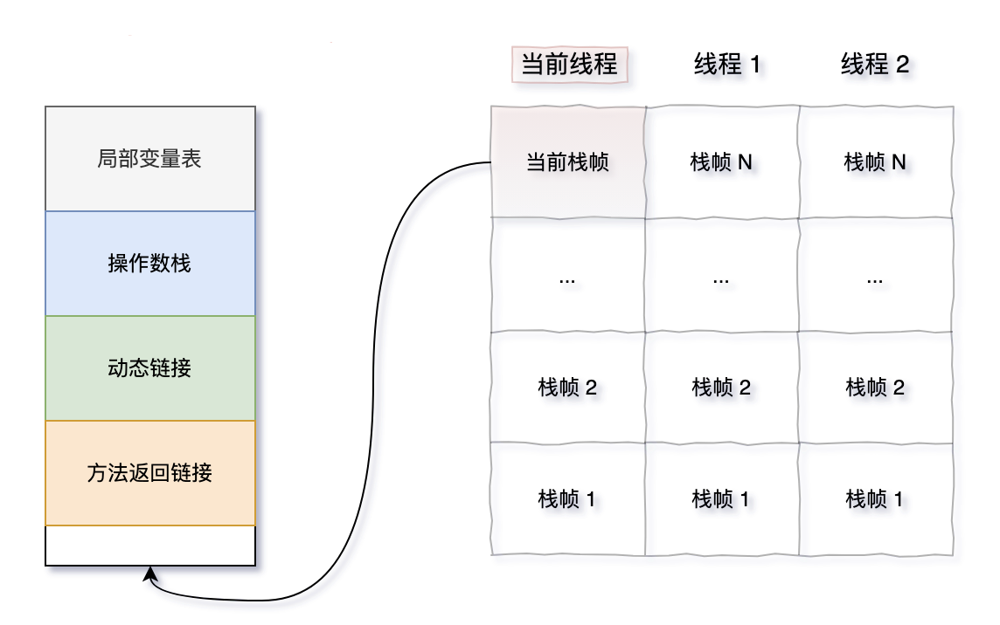
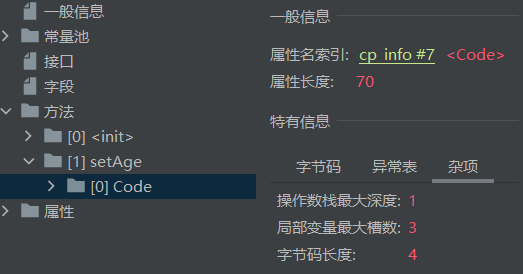
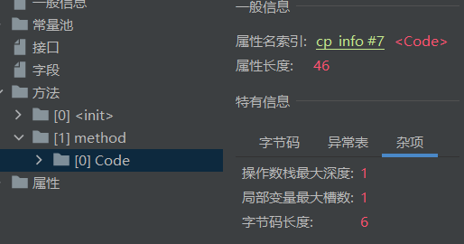
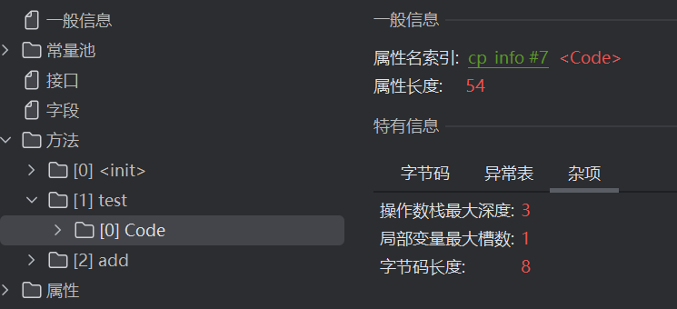
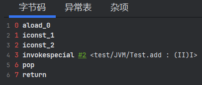

- Java 的源码文件经过编译器编译后会生成字节码文件，然后由 JVM 的类加载器进行加载，再交给执行引擎执行。在执行过程中，JVM 会划出一块内存空间来存储程序执行期间所需要用到的数据，这块空间一般被称为==运行时数据区==。

- ==栈帧==（Stack Frame）是运行时数据区中用于支持虚拟机进行方法调用和方法执行的数据结构。每一个方法从调用开始到执行完成，都对应着一个栈帧在虚拟机栈/本地方法栈里从入栈到出栈的过程

- 在编译程序代码时，栈帧中需要多大的==局部变量表==，多深的操作数栈都已经完全确定了，并且写入到方法表的Code属性中。

- 一个线程中的方法调用链可能会很长，很多方法都处于执行状态。在当前线程中，位于栈顶的栈帧被称为当前栈帧（Current Stack Frame），与这个栈帧相关联的方法成为当前方法。执行引擎运行的所有字节码指令都是对当前栈帧进行操作。

- 栈帧是线程私有的，每个线程有自己的 JVM 栈。方法调用时，新栈帧被推入栈顶；方法完成后，栈帧出栈。

  栈帧的局部变量表的大小和操作数栈的最大深度在编译时就已确定。栈空间不足时可能引发 `StackOverflowError`。




## 局部变量表

------

- 局部变量表（Local Variables Table）用来保存方法中的局部变量，以及方法参数。当 Java 源代码文件被编译成 class 文件的时候，局部变量表的最大容量就已经确定了

```java
private void setAge(int age) {
    String name = "haha";
}
```



局部变量表的最大容量为3，一个age，一个name，还有一个是调用这个成员方法的对象引用==this==。调用方法 `setAge(18)`，实际上是调用 `setAge(this, 18)`


第 0 个是 this，类型为 LocalVaraiablesTable 对象；第 1 个是方法参数 age，类型为整型 int；第 2 个是方法内部的局部变量 name，类型为字符串 String。

- 局部变量表的大小并不是方法中所有局部变量的数量之和，它与变量的类型和变量的作用域有关。当一个局部变量的作用域结束了，它占用的局部变量表中的位置就被接下来的局部变量取代了

```java
public static void method() {
    if (true) {
        String name = "h";
    }
    if (true) {
        int age = 1;
    }
}
```



`method()` 方法的局部变量表大小为 1，因为是静态方法，所以==不需要添加 this 作为局部变量表的第一个元素==，两处if作用域中都只有一个变量，前一个作用域结束后，局部变量表中的位置会留给后面一个作用域的变量用

- 局部变量表的容量以槽（slot）为最小单位，一个槽可以容纳一个 32 位的数据类型（比如说 int），像 float 和 double 这种明确占用 64  位的数据类型会占用两个紧挨着的槽

## 操作数栈

------

- 同局部变量表一样，操作数栈（Operand Stack）的最大深度也在编译的时候就确定了，被写入到了 Code 属性的 `maximum stack size` 中

```java
public class Test {
    public void test() {
        add(1, 2);
    }

    private int add(int a, int b) {
        return a + b;
    }
}
```





`test()` 方法中调用了 `add()` 方法，传递了 2 个参数。用 jclasslib 可以看到，`test()` 方法的 maximum stack size 的值为 3。因为调用成员方法的时候会将 this 和所有参数压入栈中，调用完毕后 this 和参数都会一一出栈

## 动态链接

------

- 每个栈帧都包含了一个指向运行时常量池中该栈帧所属方法的引用，持有这个引用是为了支持方法调用过程中的动态链接（Dynamic Linking）。


- ==方法区==是 JVM 的一个运行时内存区域，属于逻辑定义，不同版本的 JDK 都有不同的实现，但主要的作用就是用于存储已被虚拟机加载的类信息、常量、静态变量，以及即时编译器编译后的代码等。

- ==运行时常量池==（Runtime Constant Pool）是方法区的一部分，用于存放编译期生成的各种字面量和符号引用——在类加载后进入运行时常量池。

```java
static abstract class Vehicle{
    protected abstract void run();
}

static class Car extends Vehicle{
    @Override
    protected void run() {
        System.out.println("地上跑");
    }
}

static class Plane extends Vehicle{
    @Override
    protected void run() {
        System.out.println("天上飞");
    }
}

public static void main(String[] args) {
    Vehicle car = new Car();
    Vehicle plane =  new Plane();
    // 地上跑
    car.run();
    // 天上飞
    plane.run();
    car = new Plane();
    // 天上飞
    car.run();
}
```

main()方法字节码解析：

```java
// new 指令创建了一个 Car 对象，并将对象的内存地址压入栈中 
0 new #2 <test/JVM/Test$Car>
// dup 指令将栈顶的值复制一份并压入栈顶。因为接下来的指令 invokespecial 会消耗掉一个当前类的引用，所以需要复制一份。
 3 dup
// invokespecial 指令用于调用构造方法进行初始化。
 4 invokespecial #3 <test/JVM/Test$Car.<init> : ()V>
// astore_1，Java 虚拟机从栈顶弹出 Car 对象的引用，然后将其存入下标为 1 局部变量 man 中
 7 astore_1
     
// // 同上
 8 new #4 <test/JVM/Test$Plane>
11 dup
12 invokespecial #5 <test/JVM/Test$Plane.<init> : ()V>
15 astore_2

// aload_1 指令将第局部变量 car 压入操作数栈中
16 aload_1
// invokevirtual 指令调用对象的成员方法run，此时对象类型为test/JVM/Test$Vehicle
17 invokevirtual #6 <test/JVM/Test$Vehicle.run : ()V>
    
// 同上
20 aload_2
21 invokevirtual #6 <test/JVM/Test$Vehicle.run : ()V>
    
24 new #4 <test/JVM/Test$Plane>
27 dup
28 invokespecial #5 <test/JVM/Test$Plane.<init> : ()V>
31 astore_1
32 aload_1
33 invokevirtual #6 <test/JVM/Test$Vehicle.run : ()V>
36 return
```

从字节码的角度来看，`car.run()`（第 17 行）和 `plane.run()`（第 21 行）的字节码是完全相同的，但我们都知道，这两句指令最终执行的目标方法并不相同。

- invokevirtual 指令在运行时的解析过程可以分为以下几步：

	1. 找到操作数栈顶的元素所指向的对象的实际类型，记作 C。
	2. 如果在类型 C 中找到与常量池中的描述符匹配的方法，则进行访问权限校验，如果通过则返回这个方法的直接引用，查找结束；否则返回 `java.lang.IllegalAccessError` 异常。
	3. 否则，按照继承关系从下往上一次对 C 的各个父类进行第二步的搜索和验证。
	4. 如果始终没有找到合适的方法，则抛出 `java.lang.AbstractMethodError` 异常

- invokevirtual 指令在第一步的时候就确定了运行时的实际类型，所以两次调用中的 invokevirtual  指令并不是把常量池中方法的符号引用解析到直接引用上就结束了，还会==根据方法接受者的实际类型来选择方法版本==，这个过程就是 Java  重写的本质。我们把这种在运行期根据实际类型确定方法执行版本的过程称为==动态链接==。

## 方法返回地址

------

- 当一个方法开始执行后，只有两种方式可以退出这个方法：

  - 正常退出，可能会有返回值传递给上层的方法调用者，方法是否有返回值以及返回值的类型根据方法返回的指令来决定，像之前提到的 ireturn 用于返回 int 类型，return 用于 void 方法

  - 异常退出，方法在执行的过程中遇到了异常，并且没有得到妥善的处理，这种情况下，是不会给它的上层调用者返回任何值的。

- 方法退出的过程实际上等同于把当前栈帧出栈，因此接下来可能执行的操作有：恢复上层方法的局部变量表和操作数栈，把返回值（如果有的话）压入调用者栈帧的操作数栈中，调整 PC 计数器的值，找到下一条要执行的指令等

## 附加信息

------

- 虚拟机规范允许具体的虚拟机实现增加一些规范里没有描述的信息到栈帧中，例如与调试相关的信息，这部分信息完全取决于具体的虚拟机实现。实际开发中，一般会把动态连接、方法返回地址与其他附加信息全部归为一类，成为栈帧信息。


