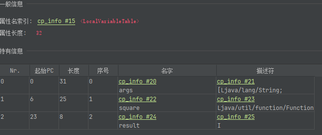
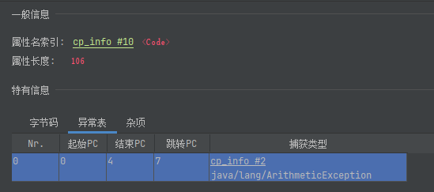

## 加载与存储指令

------

```java
public int add(int a, int b) {
    int res = a + b;
    return res;
}
```

- 字节码指令

```java
public int add(int, int);
    descriptor: (II)I
    flags: (0x0001) ACC_PUBLIC
    Code:
      stack=2, locals=4, args_size=3
         0: iload_1
         1: iload_2
         2: iadd
         3: istore_3
         4: iload_3
         5: ireturn
```

### 1. 将局部变量表中的变量压入操作数栈

- `xload_<n>`（x 为 i、l、f、d、a，n 默认为 0 到 3），表示将第 n 个局部变量压入操作数栈中。
- `xload`（x 为 i、l、f、d、a），通过指定参数的形式，将局部变量压入操作数栈中，当使用这个指令时，表示局部变量的数量可能超过了 4 个

| 操作码助记符 |   数据类型   |
| :----------: | :----------: |
|      i       |     int      |
|      l       |     long     |
|      s       |    short     |
|      b       |     byte     |
|      c       |     char     |
|      f       |    float     |
|      d       |    double    |
|      a       | 引用数据类型 |

-  arraylength 指令，没有操作码助记符，没有代表数据类型的特殊字符，但操作数只能是一个数组类型的对象。

- 大部分的指令都不支持 byte、short 和 char，甚至没有任何指令支持 boolean 类型。编译器会将 byte 和 short  类型的数据带符号扩展（Sign-Extend）为 int 类型，将 boolean 和 char 零位扩展（Zero-Extend）为 int  类型。

```java
private void load(int age, String name, long birthday, boolean sex) {
    System.out.println(age + name + birthday + sex);
}
```

load方法字节码：

```java
 0 getstatic #2 <java/lang/System.out : Ljava/io/PrintStream;>
 3 new #3 <java/lang/StringBuilder>
 6 dup
 7 invokespecial #4 <java/lang/StringBuilder.<init> : ()V>
// 将局部变量表中下标为 1 的 int 变量压入操作数栈中
10 iload_1
11 invokevirtual #5 <java/lang/StringBuilder.append : (I)Ljava/lang/StringBuilder;>
// 将局部变量表中下标为 2 的引用数据类型变量（此时为 String）压入操作数栈中
14 aload_2
15 invokevirtual #6 <java/lang/StringBuilder.append : (Ljava/lang/String;)Ljava/lang/StringBuilder;>
// 将局部变量表中下标为 3 的 long 型变量压入操作数栈中
18 lload_3
19 invokevirtual #7 <java/lang/StringBuilder.append : (J)Ljava/lang/StringBuilder;>
// 将局部变量表中下标为 5 的 int 变量（实际为 boolean）压入操作数栈中
22 iload 5
24 invokevirtual #8 <java/lang/StringBuilder.append : (Z)Ljava/lang/StringBuilder;>
27 invokevirtual #9 <java/lang/StringBuilder.toString : ()Ljava/lang/String;>
30 invokevirtual #10 <java/io/PrintStream.println : (Ljava/lang/String;)V>
33 return
```

### 2.将常量池中的常量压入操作数栈中

- 根据数据类型和入栈内容的不同，又可以细分为 const 系列、push 系列和 Idc 指令。

#### 2.1 const系列

- 用于特殊的常量入栈，要入栈的常量隐含在指令本身

|     指令      |    含义    |
| :-----------: | :--------: |
| `iconst_<n>`  |  n从-1到5  |
| `lconst_<n>`  |  n从0到1   |
| `fconst_<n>`  |  n从0到2   |
| `dconst_<n>`  |  n从0到1   |
| `aconst_null` | 将null入栈 |

#### 2.2 push系列

- 主要包括 `bipush` 和 `sipush`，前者接收 8 位整数作为参数，后者接收 16 位整数。

#### 2.3 ldc系列

- 它接收一个 8 位的参数，指向常量池中的索引。

- `ldc_w`：接收两个 8 位数，索引范围更大。
- 如果参数是 long 或者 double，使用 `ldc2_w` 指令。

```java
public void pushConstLdc() {
    // 范围 [-1,5]
    int iConst = -1;
    // 范围 [-128,127]
    int biPush = 127;
    // 范围 [-32768,32767]
    int siPush= 32767;
    // 其他 int
    int ldc = 32768;
    String aConst = null;
    String ldcString = "hh";
}
```

```java
// 将 -1 入栈 
 0 iconst_m1
 1 istore_1
// 将 127 入栈
 2 bipush 127
 4 istore_2
// 将 32767 入栈
 5 sipush 32767
 8 istore_3
// 将常量池中下标为 2 的常量 32768 入栈
 9 ldc #2 <32768>
11 istore 4
// 将 null 入栈
13 aconst_null
14 astore 5
// 将常量池中下标为 3 的常量“hh”入栈
16 ldc #3 <hh>
18 astore 6
20 return
```

### 3. 将栈顶的数据出栈并装入局部变量表中

- `xstore_<n>`（x 为 i、l、f、d、a，n 默认为 0 到 3）
- `xstore`（x 为 i、l、f、d、a）

```java
public void fun(int age, String name) {
    int temp = age + 2;
    String str = name;
}
```

局部变量表:


fun的字节码：

```java
// 将局部变量表中下标为 1 的 int 变量压入操作数栈中
0 iload_1
// 将常量 2 入栈
1 iconst_2
2 iadd
// 从操作数中弹出一个整数，并把它赋值给局部变量表中索引为 3 的变量
3 istore_3
// 将局部变量表中下标为 2 的引用数据类型变量（此时为 String）压入操作数栈中
4 aload_2
// 从操作数中弹出一个引用数据类型，并把它赋值给局部变量表中索引为 4 的变量
5 astore 4
7 return
```

## 算术指令

------

- 算术指令用于对两个操作数栈上的值进行某种特定运算，并把结果重新压入操作数栈。可以分为两类：整型数据的运算指令和浮点数据的运算指令。

- **数据运算可能会导致溢出**，但 Java 虚拟机规范中并没有对这种情况给出具体结果，因此程序是==不会显式报错==；当发生溢出时，将会使用有符号的无穷大 Infinity 来表示；如果某个操作结果没有明确的数学定义的话，将会使用 NaN 值来表示。而且所有使用 NaN 作为操作数的算术操作，结果都会返回 NaN。

- Java 虚拟机提供了两种运算模式：

  - 向最接近数舍入：在进行浮点数运算时，所有的结果都必须舍入到一个适当的精度，不是特别精确的结果必须舍入为可被表示的最接近的精确值，如果有两种可表示的形式与该值接近，将优先选择最低有效位为零的（类似四舍五入）。

  - 向零舍入：将浮点数转换为整数时，采用该模式，该模式将在目标数值类型中选择一个最接近但是不大于原值的数字作为最精确的舍入结果（类似取整）。

- 算术指令：

  - 加法指令：`iadd、ladd、fadd、dadd`

  - 减法指令：`isub、lsub、fsub、dsub`

  - 乘法指令：`imul、lmul、fmul、dmul`

  - 除法指令：`idiv、ldiv、fdiv、ddiv`

  - 求余指令：`irem、lrem、frem、drem`

  - 自增指令：`iinc`

## 类型转换指令

------

类型转换指令可以分为两种：

- 宽化，小类型向大类型转换，比如 `int–>long–>float–>double`，对应的指令有：`i2l、i2f、i2d、l2f、l2d、f2d`。

  - 从 int 到 long，或者从 int 到 double，是不会有精度丢失的；

  - 从 int、long 到 float，或者 long 到 double 时，可能会发生精度丢失；

  - 从 byte、char 和 short 到 int 的宽化类型转换实际上是隐式发生的，这样可以减少字节码指令，毕竟字节码指令只有 256 个，占一个字节。

- 窄化，大类型向小类型转换，比如从 int 类型到 byte、short 或者 char，对应的指令有：`i2b、i2s、i2c`；从 long 到 int，对应的指令有：`l2i`；从 float 到 int 或者 long，对应的指令有：`f2i、f2l`；从 double 到 int、long 或者  float，对应的指令有：`d2i、d2l、d2f`。

## 对象的创建和访问指令

------

### 创建指令

- 创建数组的指令有三种：

  - `newarray`：创建基本数据类型的数组

  - `anewarray`：创建引用类型的数组

  - `multianewarray`：创建多维数组

- 创建对象指令只有一个，就是 `new`，它会接收一个操作数，指向常量池中的一个索引，表示要创建的类型。

```java
public static void main(String[] args) {
    String name = new String("haha");
    File file = new File("xixi");
    int[] ages = {};
}
```

```java
// 创建一个 String 对象
 0 new #2 <java/lang/String>
 3 dup
 4 ldc #3 <haha>
 6 invokespecial #4 <java/lang/String.<init> : (Ljava/lang/String;)V>
 9 astore_1
// 创建一个 File 对象
10 new #5 <java/io/File>
13 dup
14 ldc #6 <xixi>
16 invokespecial #7 <java/io/File.<init> : (Ljava/lang/String;)V>
19 astore_2
20 iconst_0
// 创建一个 int 类型的数组
21 newarray 10 (int)
23 astore_3
24 return
```

### 字段访问指令

- 访问静态变量：`getstatic`、`putstatic`。
- 访问成员变量：`getfield`、`putfield`，需要创建对象后才能访问。

```java
class Writer {
    private String name;
    static String mark = "作者";

    public static void main(String[] args) {
        print(mark);
        Writer w = new Writer();
        print(w.name);
    }

    public static void print(String arg) {
        System.out.println(arg);
    }
}
```

```java
// 访问静态变量 mark
 0 getstatic #2 <test/JVM/Writer.mark : Ljava/lang/String;>
 3 invokestatic #3 <test/JVM/Writer.print : (Ljava/lang/String;)V>
 6 new #4 <test/JVM/Writer>
 9 dup
10 invokespecial #5 <test/JVM/Writer.<init> : ()V>
13 astore_1
14 aload_1
// 访问成员变量 name
15 getfield #6 <test/JVM/Writer.name : Ljava/lang/String;>
18 invokestatic #3 <test/JVM/Writer.print : (Ljava/lang/String;)V>
21 return
```

## 方法调用指令

------

- `invokevirtual`：用于调用对象的成员方法，根据对象的实际类型进行分派，支持多态。
- `invokeinterface`：用于调用接口方法，会在运行时搜索由特定对象实现的接口方法进行调用。
- `invokespecial`：用于调用一些需要特殊处理的方法，包括构造方法、私有方法和父类方法。
- `invokestatic`：用于调用静态方法。
- `invokedynamic`：用于在运行时动态解析出调用点限定符所引用的方法，并执行。Lambda 表达式的实现就依赖于 invokedynamic 指令。

```java
public static void main(String[] args) {
    // 使用 Lambda 表达式定义一个函数
    Function<Integer, Integer> square = x -> x * x;
    int result = square.apply(5);
    System.out.println(result);
}
```



```java
// 使用 invokedynamic 调用一个引导方法（Bootstrap Method），这个方法负责实现并返回一个 Function 接口的实例
 0 invokedynamic #2 <apply, BootstrapMethods #0>
// astore_1：将 invokedynamic 指令的结果（Lambda 表达式的 Function 对象）存储到局部变量表的位置 1。
 5 astore_1
 6 aload_1
 7 iconst_5
 8 invokestatic #3 <java/lang/Integer.valueOf : (I)Ljava/lang/Integer;>
11 invokeinterface #4 <java/util/function/Function.apply : (Ljava/lang/Object;)Ljava/lang/Object;> count 2
16 checkcast #5 <java/lang/Integer>
19 invokevirtual #6 <java/lang/Integer.intValue : ()I>
22 istore_2
23 getstatic #7 <java/lang/System.out : Ljava/io/PrintStream;>
26 iload_2
27 invokevirtual #8 <java/io/PrintStream.println : (I)V>
30 return
```

lambda表达式的实现：`lambda$main$0`


## 返回指令

------

|  指令   |              类型               |
| :-----: | :-----------------------------: |
| return  |              void               |
| ireturn | int(boolean、byte、char、short) |
| lreturn |              long               |
| freturn |              float              |
| dreturn |             double              |
| areturn |            引用类型             |

## 操作数栈管理指令

------

常见的操作数栈管理指令有 `pop、dup 和 swap`。

- 将一个或两个元素从栈顶弹出，并且直接废弃，比如 pop，pop2；
- 复制栈顶的一个或两个数值并将其重新压入栈顶，比如 dup，dup2，`dup×1`，`dup2_×1`，`dup_×2`，`dup2_×2`；
- 将栈最顶端的两个槽中的数值交换位置，比如 swap。

## 控制转移指令

------

### 比较指令

- 比较指令有：`dcmpg，dcmpl、fcmpg、fcmpl、lcmp`，指令的第一个字母代表的含义分别是 double、float、long。注意，==没有 int 类型==
- 对于 double 和 float 来说，由于 NaN 的存在，有两个版本的比较指令。拿 float 来说，有 fcmpg 和 fcmpl，区别在于，如果遇到 NaN，fcmpg 会将 1 压入栈，fcmpl 会将 -1 压入栈。

### 条件转移指令

|   指令    |      含义       |
| :-------: | :-------------: |
|   ifeq    |   等于0时跳转   |
|   ifne    |  不等于0时跳转  |
|   iflt    |   小于0时跳转   |
|   ifle    | 小于等于0时跳转 |
|   ifgt    |   大于0时跳转   |
|   ifge    | 大于等于0时跳转 |
|  ifnull   |  为null时跳转   |
| ifnonnull | 不为null时跳转  |

- 这些指令都会接收两个字节的操作数，它们的统一含义是，弹出栈顶元素，测试它是否满足某一条件，满足的话，跳转到对应位置。

- 对于 long、float 和 double 类型的条件分支比较，会先执行比较指令返回一个整型值到操作数栈中后再执行 int 类型的条件跳转指令。

- 对于 boolean、byte、char、short，以及 int，则直接使用条件跳转指令来完成。

### 比较条件转移指令

|   指令    |                     含义                      |
| :-------: | :-------------------------------------------: |
| if_icmpeq |       比较栈顶两个int的数值，相等时跳转       |
| if_icmpne |       比较栈顶两个int的数值，不等时跳转       |
| if_icmplt |   比较栈顶两个int的数值，前者小于后者时跳转   |
| if_icmple | 比较栈顶两个int的数值，前者小于等于后者时跳转 |
| if_icmpgt |  比较栈顶两个int的数值，前者小大于后者时跳转  |
| if_icmpge | 比较栈顶两个int的数值，前者大于等于后者时跳转 |
| if_acmpeq |    比较栈顶两个引用类型的大小，相等时跳转     |
| if_acmpne |    比较栈顶两个引用类型的大小，不等时跳转     |

### 多分支转移指令

- `tableswitch`：要求多个条件分支值是连续的，它内部只存放起始值和终止值，以及若干个跳转偏移量，通过给定的操作数 index，可以立即定位到跳转偏移量位置，因此效率比较高
- `lookupswitch`：内部存放着各个离散的 case-offset 对，每次执行都要搜索全部的 case-offset 对，找到匹配的 case 值，并根据对应的 offset 计算跳转地址，因此效率较低。

### 无条件转移指令

- `goto` 指令接收两个字节的操作数，共同组成一个带符号的整数，用于指定指令的偏移量，指令执行的目的就是跳转到偏移量给定的位置处。如果指令的偏移量特别大，超出了两个字节的范围，可以使用指令 `goto_w`，接收 4 个字节的操作数。

## 异常处理时的字节码指令

------

```java
public static void main(String[] args) {
    try {
        int a = 1 / 0;
    } catch (ArithmeticException e) {
        System.out.println("算术异常");
    }
}
```

```java
// 常数1入栈
 0 iconst_1
// 常数0入栈
 1 iconst_0
 2 idiv
// 将除法的结果存储到局部变量表中（这里会发生异常，指令实际上不会执行）
 3 istore_1
// 在 try 块的末尾，有一个 goto 指令跳过 catch 块的代码，跳到第16条处，+12是相对于当前位置的偏移量
 4 goto 16 (+12)
// catch 块的开始。如果捕获到异常，将异常对象存储到局部变量表。
 7 astore_1

// 8~13指令执行 System.out.println("发生算术异常")。
 8 getstatic #3 <java/lang/System.out : Ljava/io/PrintStream;>
11 ldc #4 <算术异常>
13 invokevirtual #5 <java/io/PrintStream.println : (Ljava/lang/String;)V>
    
16 return
```



异常表中的信息表示当在字节码偏移量 0 到 4 之间发生 `ArithmeticException` 时，控制跳转到偏移量 7，即 `catch` 块的开始。

## synchronized 的字节码指令

------

```java
public void syncBlockMethod() {
    synchronized (this) {
    }
}
```

```java
// 将局部变量表中下标为 0 的 this 压入操作数栈中
 0 aload_0
// 复制栈顶的 this 并重新入栈
 1 dup
// 取出栈顶的 this 放入局部变量表中下标为 1 的位置
 2 astore_1
// 同步块的开始
 3 monitorenter
//  将局部变量表中下标为 1 的 this 压入操作数栈中
 4 aload_1
// 同步块的结束
 5 monitorexit
 6 goto 14 (+8)
 9 astore_2
10 aload_1
11 monitorexit
12 aload_2
13 athrow
14 return
```


