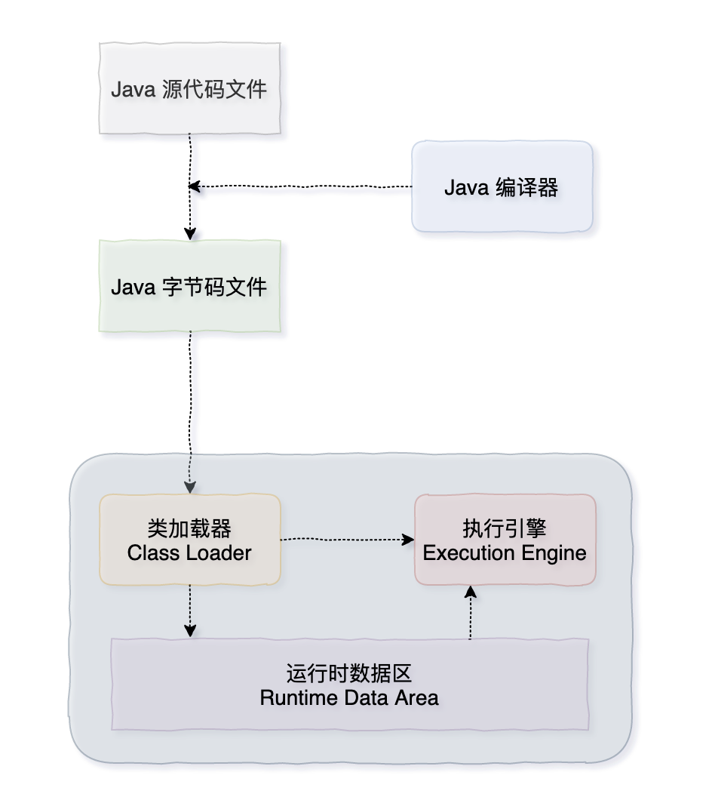
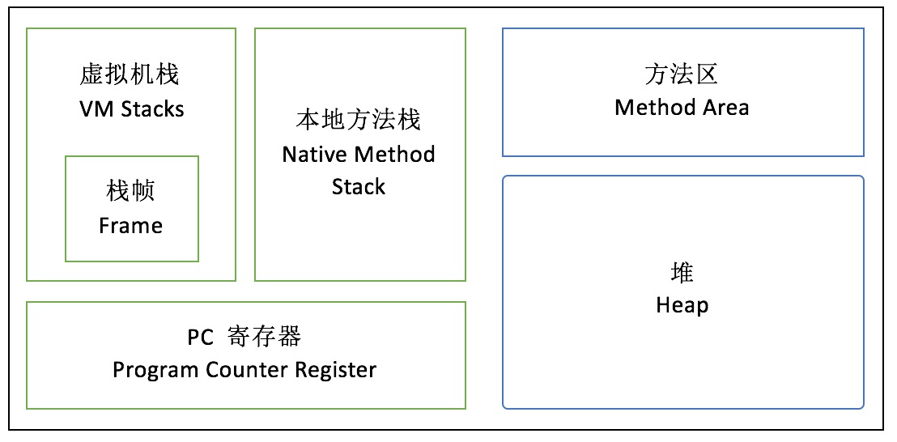
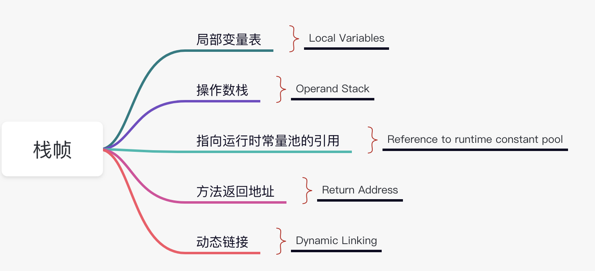
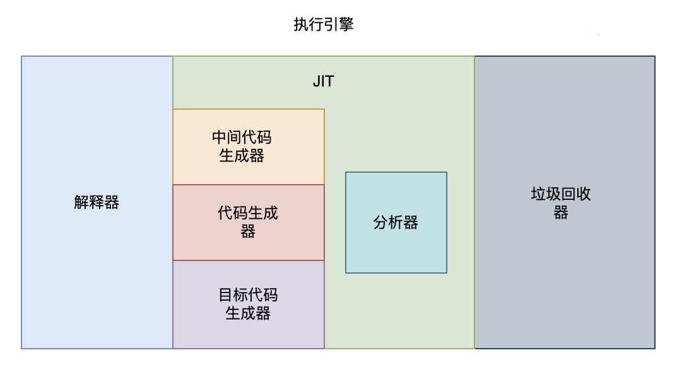
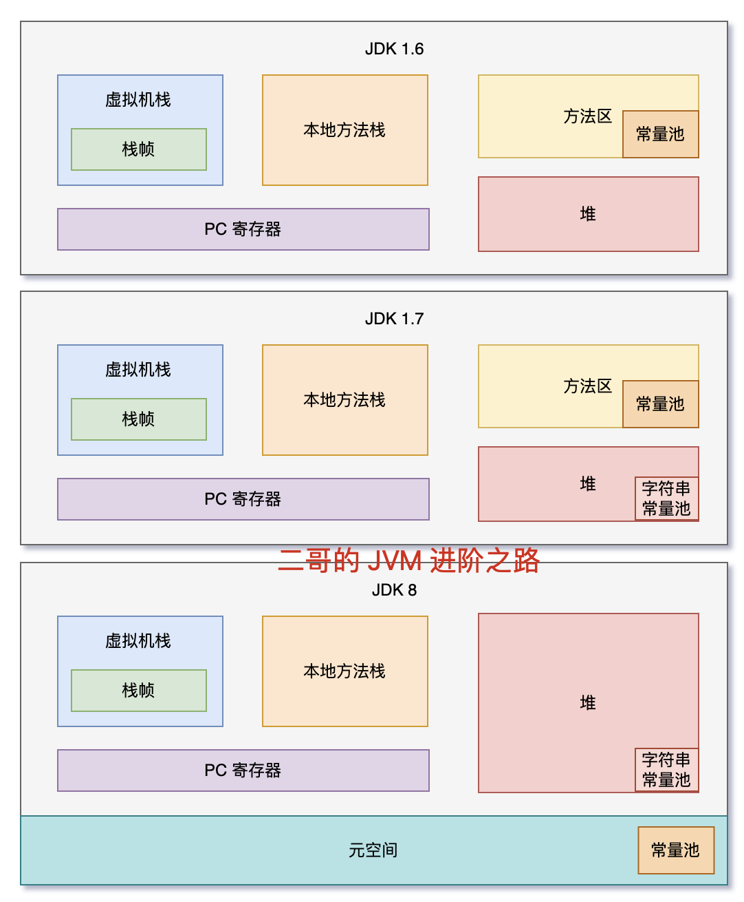
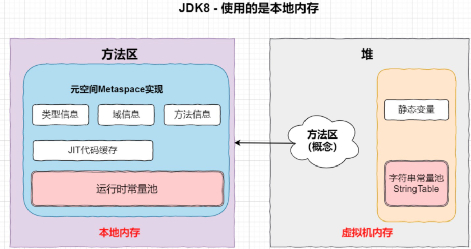

- Java 源代码文件经过编译器编译后会生成字节码文件，经过加载器加载完毕后会交给执行引擎执行。在执行的过程中，JVM 会划出来一块空间来存储程序执行期间需要用到的数据，这块空间一般被称为运行时数据区

根据 Java 虚拟机规范的规定，运行时数据区可以分为以下几个部分：

- 程序计数器（Program Counter Register）
- Java 虚拟机栈（Java Virtual Machine Stacks）
- 本地方法栈（Native Method Stack）
- 堆（Heap）
- 方法区（Method Area）

>JDK 8 开始，永久代被彻底移除，取而代之的是元空间。元空间不再是 JVM 内存的一部分，而是通过本地内存（Native Memory）来实现的。也就是说，JDK 8 开始，方法区的实现就是元空间。

## 程序计数器PC

------

- 为了线程切换后能恢复到正确的执行位置，每个线程都需要有一个独立的程序计数器，并且不能互相干扰

- 如果线程执行的是非本地方法，则程序计数器中保存的是当前需要执行的指令地址；如果线程执行的是本地方法，则程序计数器中的值是 undefined

## Java虚拟机栈

------

- Java 虚拟机栈（JVM 栈）中是一个个栈帧，每个栈帧对应一个被调用的方法。当线程执行一个方法时，会创建一个对应的栈帧，并将栈帧压入栈中。当方法执行完毕后，将栈帧从栈中移除。

- Java 虚拟机栈的特点如下：
  - 线程私有： ==每个线程都有自己的 JVM 栈==，线程之间的栈是不共享的。
  - 栈溢出： 如果栈的深度超过了 JVM 栈所允许的深度，将会抛出 `StackOverflowError`。

- 通过 `java -XX:+PrintFlagsFinal -version | grep ThreadStackSize` 这个命令可以查看 JVM 栈的默认大小。

## 本地方法栈

------

本地方法栈（Native Method Stack）与 Java 虚拟机栈类似，只不过 Java 虚拟机栈为虚拟机执行 Java 方法服务，而本地方法栈则为虚拟机使用到的 Native 方法服务。

## 堆

------

- 堆是所有线程共享的一块内存区域，在 JVM 启动的时候创建，用来存储对象（数组也是一种对象）。

- 以前，Java 中“几乎”所有的对象都会在堆中分配，但随着 JIT 编译器的发展和逃逸技术的逐渐成熟，所有的对象都分配到堆上渐渐变得不那么“绝对”了。从 JDK 7 开始，Java 虚拟机已经默认开启逃逸分析了，意味着如果某些方法中的对象引用没有被返回或者未被外面使用（也就是未逃逸出去），那么对象可以直接在栈上分配内存。

- 常见的编译型语言如 C++，通常会把代码直接编译成 CPU 所能理解的机器码来运行。而 Java  为了实现“一次编译，处处运行”的特性，把编译的过程分成两部分，首先它会先由 javac  编译成通用的中间形式——字节码，然后再由解释器逐条将字节码解释为机器码来执行。
- 为了优化 Java 的性能 ，JVM 在解释器之外引入了 JIT  编译器：当程序运行时，解释器首先发挥作用，代码可以直接执行。随着时间推移，即时编译器逐渐发挥作用，把越来越多的代码编译优化成本地代码，来获取更高的执行效率。解释器这时可以作为编译运行的降级手段，在一些不可靠的编译优化出现问题时，再切换回解释执行，保证程序可以正常运行。
- ==逃逸分析==（Escape Analysis）是一种编译器优化技术，用于判断对象的作用域和生命周期。如果编译器确定一个对象不会逃逸出方法或线程的范围，它可以选择在栈上分配这个对象，而不是在堆上。这样做可以减少垃圾回收的压力，并提高性能。

- 堆除了是对象的聚集地，也是 ==Java 垃圾收集器== 管理的主要区域，因此也被称作 GC 堆（Garbage Collected  Heap）。从垃圾回收的角度来看，由于垃圾收集器基本都采用了分代垃圾收集的算法，所以堆还可以细分为：新生代和老年代。新生代还可以细分为：Eden 空间、From Survivor、To Survivor 空间等。进一步划分的目的是更好地回收内存，或者更快地分配内存。
- 堆这最容易出现的就是 OutOfMemoryError 错误，分为以下几种表现形式：
  - `OutOfMemoryError: GC Overhead Limit Exceeded`：当 JVM 花太多时间执行垃圾回收并且只能回收很少的堆空间时，就会发生该错误。
  - `java.lang.OutOfMemoryError: Java heap space`：假如在创建新的对象时, 堆内存中的空间不足以存放新创建的对象, 就会引发该错误。和本机的物理内存无关，和我们配置的虚拟机内存大小有关！
- `java -XX:+PrintFlagsFinal -version | grep HeapSize`可以查看 JVM 堆的默认大小

## 元空间和方法区

------

- 方法区是 Java 虚拟机规范上的一个逻辑区域，在不同的 JDK 版本上有着不同的实现。在 JDK 7 的时候，方法区被称为永久代（PermGen），而在 JDK 8 的时候，永久代被彻底移除，取而代之的是元空间。

- 元空间的大小不再受限于 JVM 启动时设置的最大堆大小，而是直接利用本地内存，也就是操作系统的内存。有效地解决了 OutOfMemoryError 错误。
- 方法区（不管是永久代还是元空间的实现）和堆一样，**是线程共享的区域**。

### 运行时常量池

- 是字节码文件的资源仓库，先是一个常量池大小，从 1 到 n-1，0 为保留索引，然后是常量池项的集合，包括类信息、字段信息、方法信息、接口信息、字符串常量等。

- 运行时常量池，顾名思义，就是在运行时期间，JVM 会将字节码文件中的常量池加载到内存中，存放在运行时常量池中。常量池是在字节码文件中，而运行时常量池在元空间当中（JDK 8 及以后）。

  

### 字符串常量池

- 存放字符串常量，也就是我们在代码中写的字符串。依然在堆中。

