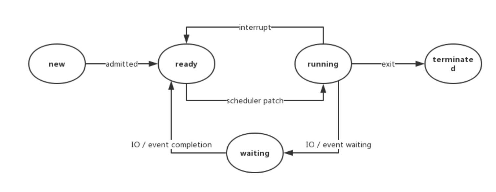
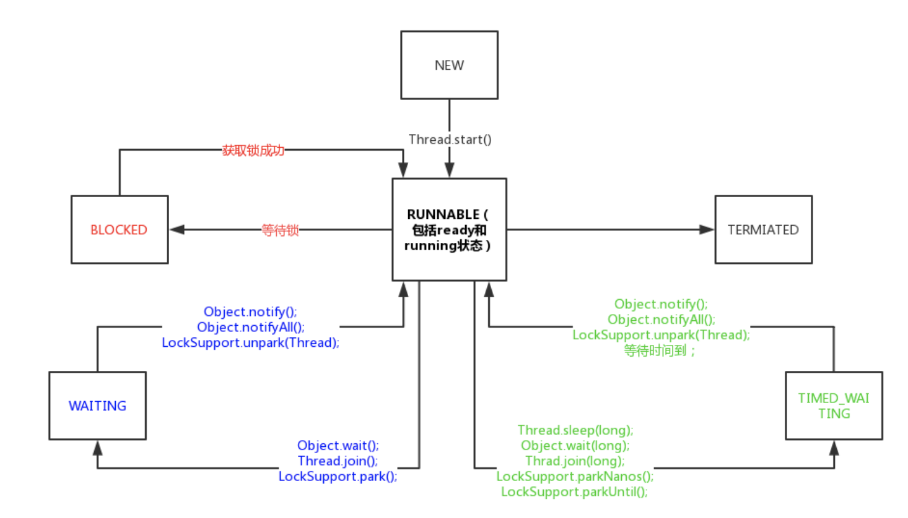

## OS 中的进程/线程状态

------

操作系统中的进程/线程状态转换图：



## Java 线程的六个状态：

------

```java
// Thread.State 源码
public enum State {
    NEW,
    RUNNABLE,
    BLOCKED,
    WAITING,
    TIMED_WAITING,
    TERMINATED;
}
```

### NEW

处于 NEW 状态的线程此时尚未启动。这里的尚未启动指的是还没调用 Thread 实例的`start()`方法。

```java
// 使用synchronized关键字保证这个方法是线程安全的
public synchronized void start() {
    // threadStatus != 0 表示这个线程已经被启动过或已经结束了
    // 如果试图再次启动这个线程，就会抛出IllegalThreadStateException异常
    if (threadStatus != 0)
        throw new IllegalThreadStateException();

    // 将这个线程添加到当前线程的线程组中
    group.add(this);

    // 声明一个变量，用于记录线程是否启动成功
    boolean started = false;
    try {
        // 使用native方法启动这个线程
        start0();
        // 如果没有抛出异常，那么started被设为true，表示线程启动成功
        started = true;
    } finally {
        // 在finally语句块中，无论try语句块中的代码是否抛出异常，都会执行
        try {
            // 如果线程没有启动成功，就从线程组中移除这个线程
            if (!started) {
                group.threadStartFailed(this);
            }
        } catch (Throwable ignore) {
            // 如果在移除线程的过程中发生了异常，我们选择忽略这个异常
        }
    }
}

```

反复调用同一个线程的 start 方法不可行，会抛出 `IllegalThreadStateException `异常

```java
public static void main(String[] args) {
    Thread thread = new Thread(() -> {
    });
    // 第一次调用 threadStatus 为0
    thread.start();
    // 第二次调用 threadStatus 非0，抛出 IllegalThreadStateException 异常
    thread.start();
}
```

```java
// Thread.getState方法源码：
public State getState() {
    // get current thread state
    return sun.misc.VM.toThreadState(threadStatus);
}

// sun.misc.VM 源码：
// 如果线程的状态值和4做位与操作结果不为0，线程处于RUNNABLE状态。
// 如果线程的状态值和1024做位与操作结果不为0，线程处于BLOCKED状态。
// 如果线程的状态值和16做位与操作结果不为0，线程处于WAITING状态。
// 如果线程的状态值和32做位与操作结果不为0，线程处于TIMED_WAITING状态。
// 如果线程的状态值和2做位与操作结果不为0，线程处于TERMINATED状态。
// 最后，如果线程的状态值和1做位与操作结果为0，线程处于NEW状态，否则线程处于RUNNABLE状态。
public static State toThreadState(int var0) {
    if ((var0 & 4) != 0) {
        return State.RUNNABLE;
    } else if ((var0 & 1024) != 0) {
        return State.BLOCKED;
    } else if ((var0 & 16) != 0) {
        return State.WAITING;
    } else if ((var0 & 32) != 0) {
        return State.TIMED_WAITING;
    } else if ((var0 & 2) != 0) {
        return State.TERMINATED;
    } else {
        return (var0 & 1) == 0 ? State.NEW : State.RUNNABLE;
    }
}
```

### RUNNABLE

表示当前线程正在运行中。处于 RUNNABLE 状态的线程在 Java 虚拟机中运行，也有可能在等待 CPU 分配资源。包括了操作系统线程的 ready 和 running 个状态

### BLOCKED

阻塞状态。处于 BLOCKED 状态的线程正等待锁的释放以进入同步区。

### WAITING

等待状态。处于等待状态的线程变成 RUNNABLE 状态需要其他线程唤醒。

调用下面这 3 个方法会使线程进入等待状态：

- `Object.wait()`：使当前线程处于等待状态直到另一个线程唤醒它；
- `Thread.join()`：等待线程执行完毕，底层调用的是 Object 的 wait 方法；
- `LockSupport.park()`：除非获得调用许可，否则禁用当前线程进行线程调度。

### TIMEED_WAITING

超时等待状态。线程等待一个具体的时间，时间到后会被自动唤醒。

调用如下方法会使线程进入超时等待状态：

- `Thread.sleep(long millis)`：使当前线程睡眠指定时间；
- `Object.wait(long timeout)`：线程休眠指定时间，等待期间可以通过`notify()`/`notifyAll()`唤醒；
- `Thread.join(long millis)`：等待当前线程最多执行 millis 毫秒，如果 millis 为 0，则会一直执行；
- `LockSupport.parkNanos(long nanos)`： 除非获得调用许可，否则禁用当前线程进行线程调度指定时间；

`LockSupport.parkUntil(long deadline)`：同上，也是禁止线程进行调度指定时间；

### TERMINATED

终止状态。此时线程已执行完毕。

## Java线程状态的转换

------



### Object.wait()

调用`wait()`方法前线程必须持有对象的锁。

线程调用`wait()`方法时，==会释放当前的锁==，直到有其他线程调用`notify()`/`notifyAll()`方法唤醒等待锁的线程。

需要注意的是，其他线程调用`notify()`方法只会唤醒单个等待锁的线程，如有有多个线程都在等待这个锁的话不一定会唤醒到之前调用`wait()`方法的线程。

同样，调用`notifyAll()`方法唤醒所有等待锁的线程之后，也不一定会马上把时间片分给刚才放弃锁的那个线程，具体要看系统的调度。

### Thread.join()

调用`join()`方法，会一直等待这个线程执行完毕（转换为 TERMINATED 状态）。

### Thread.sleep(long)

使当前线程睡眠指定时间。需要注意这里的“睡眠”只是暂时使线程停止执行，并==不会释放锁==。时间到后，线程会重新进入 RUNNABLE 状态。

### Object.wait(long)

`wait(long)`方法使线程进入 TIMED_WAITING 状态。这里的`wait(long)`方法与无参方法 wait()相同的地方是，都可以通过其他线程调用`notify()`或`notifyAll()`方法来唤醒。

不同的地方是，有参方法`wait(long)`就算其他线程不来唤醒它，经过指定时间 long 之后它会自动唤醒，拥有去争夺锁的资格。

### Thread.join(long)

`join(long)`使当前线程执行指定时间，并且使线程进入 TIMED_WAITING 状态。

### 线程中断

线程中断机制是一种协作机制。通过中断操作并==不能直接终止一个线程==，而是通知需要被中断的线程自行处理。

简单介绍下 Thread 类里提供的关于线程中断的几个方法：

- `Thread.interrupt()`：中断线程。这里的中断线程并不会立即停止线程，而是设置线程的中断状态为 true（默认是 flase）；
- `Thread.isInterrupted()`：测试当前线程是否被中断。
- `Thread.interrupted()`：检测当前线程是否被中断，与 `isInterrupted()` 方法不同的是，这个方法如果发现当前线程被中断，会清除线程的中断状态。

在线程中断机制里，当其他线程通知需要被中断的线程后，线程中断的状态被设置为 true，但是具体被要求中断的线程要怎么处理，完全由被中断线程自己决定，可以在合适的时机中断请求，也可以完全不处理继续执行下去。