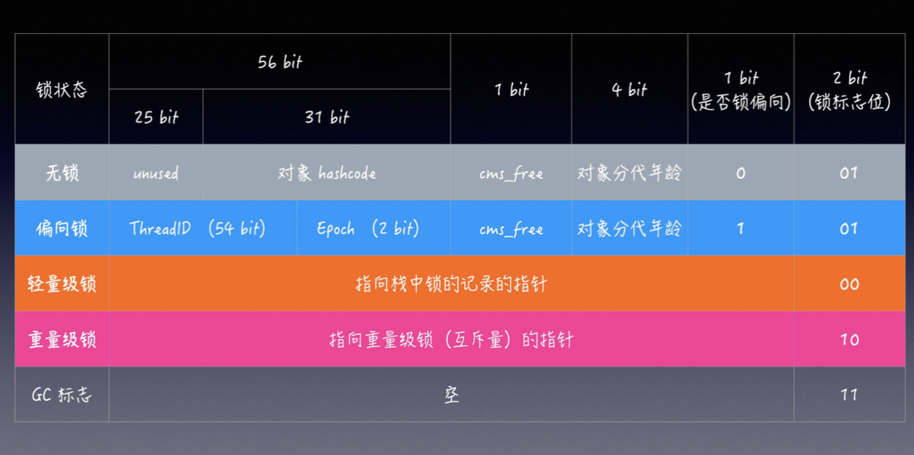
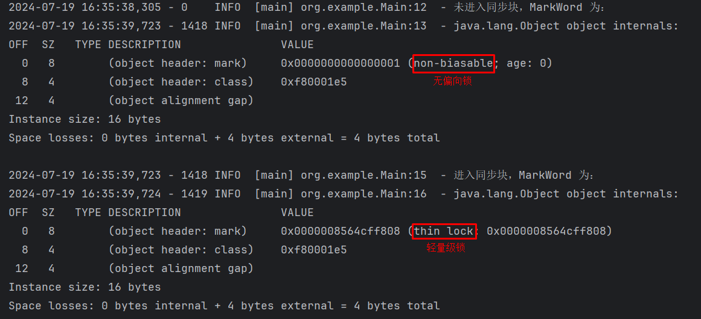
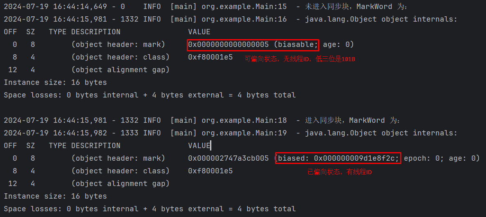
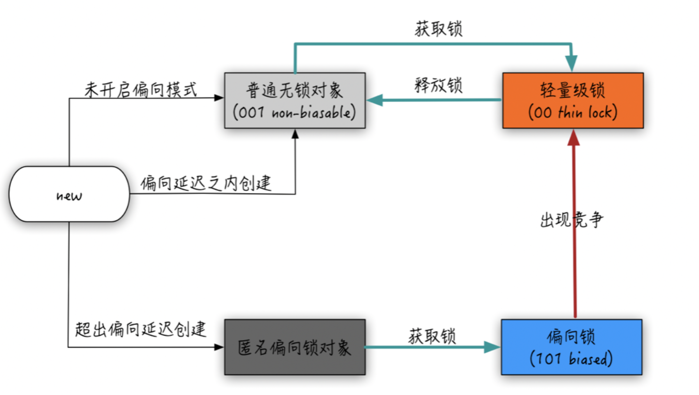
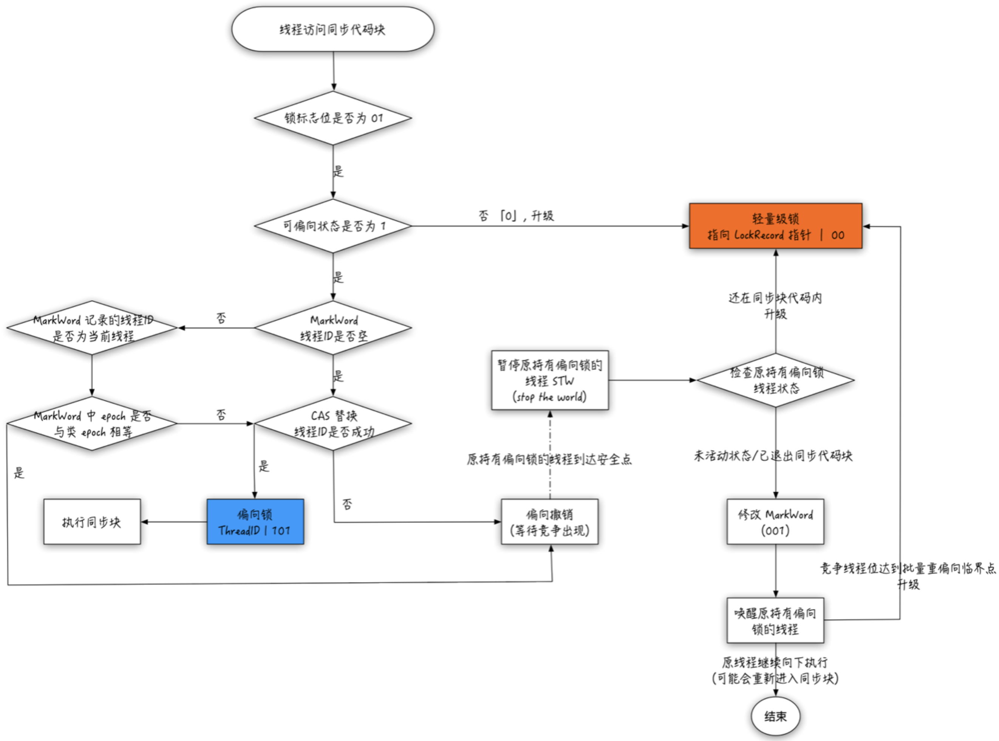
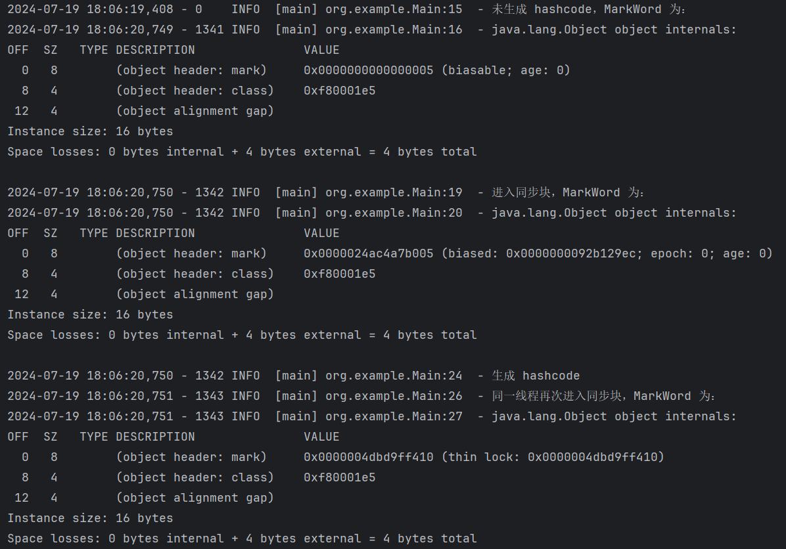
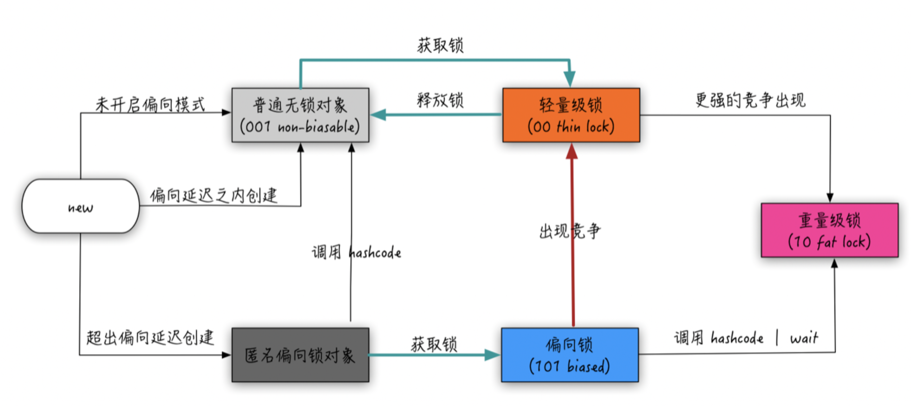

```java
public class Test {
    static int i;

    public void test() {
        synchronized (this) {
            i++;
        }
    }
}
```

```java
 0 aload_0
 1 dup
 2 astore_1
// monitorenter 指令在编译后会插入到同步代码块的开始位置
 3 monitorenter
 4 getstatic #2 <threadtest/Test.i : I>
 7 iconst_1
 8 iadd
 9 putstatic #2 <threadtest/Test.i : I>
12 aload_1
// monitorexit 指令会插入到方法结束和异常的位置（实际隐藏了try-finally）。
13 monitorexit
14 goto 22 (+8)
17 astore_2
18 aload_1
19 monitorexit
20 aload_2
21 athrow
22 return
```

每个对象都有一个 monitor 与之关联，当一个线程执行到 monitorenter 指令时，就会获得对象所对应 `monitor` 的所有权，也就获得到了对象的锁。

## 对象监视器 monitor

------

 monitor 的工作方式：

- 进入房间: 当一个线程想要进入受保护的代码区域（房间）时，它必须得到 monitor 的允许。如果房间里没有其他线程，monitor 会让它进入并关闭门。
- 等待其他线程: 如果房间里已经有一个线程，其他线程就必须等待。monitor 会让其他线程排队等候，直到房间里的线程完成工作离开房间。
- 离开房间: 当线程完成它的工作并离开受保护的代码区域时，monitor 会重新打开门，并让等待队列中的下一个线程进入。
- 协调线程: monitor 还可以通过一些特殊的机制（例如 wait 和 notify 方法）来协调线程之间的合作。线程可以通过 monitor 来发送信号告诉其他线程现在可以执行某些操作了。

## 重量级锁

------

当另外一个线程执行到同步块的时候，由于它没有对应 `monitor` 的所有权，就会被阻塞，此时控制权只能交给操作系统，也就会从 `user mode` 切换到 `kernel mode`, 由操作系统来负责线程间的调度和线程的状态变更, 这就需要频繁的在这两个模式下切换（**上下文转换**）。

## 轻量级锁

------

如果 CPU 通过 CAS 就能处理好加锁/释放锁，这样就不会有上下文的切换。

但是当竞争很激烈，CAS 尝试再多也是浪费 CPU，权衡一下，不如升级成重量级锁，阻塞线程排队竞争，也就有了轻量级锁升级成重量级锁的过程。

HotSpot 的作者经过研究发现，大多数情况下，锁不仅不存在多线程竞争，而且总是由**同一个线程**多次获得，同一个线程反复获取锁，如果还按照 CAS 的方式获取锁，也是有一定代价的，如何让这个代价更小一些呢？

## 偏向锁

------

偏向锁实际上就是「锁对象」潜意识「偏向」同一个线程来访问，让锁对象记住这个线程 ID，当线程再次获取锁时，亮出身份，如果是同一个 ID 直接获取锁就好了，是一种 `load-and-test` 的过程，相较 CAS 又轻量级了一些。

可是多线程环境，也不可能只有同一个线程一直获取这个锁，其他线程也是要干活的，如果出现多个线程竞争的情况，就会有偏向锁升级的过程。

偏向锁和轻量级锁，都不会调用系统互斥量（Mutex Lock），它们只是为了提升性能多出来的两种锁状态，这样可以在不同场景下采取最合适的策略：

- 偏向锁：无竞争的情况下，==只有一个线程进入临界区==，采用偏向锁
- 轻量级锁：多个线程可以==交替进入临界区==，采用轻量级锁
- 重量级锁：多线程==同时进入临界区==，交给操作系统互斥量来处理

### Java 对象头

Java 对象头最多由三部分构成：

1. MarkWord
2. ClassMetadata Address
3. Array Length （**如果对象是数组才会有这部分**）

其中 `Markword` 是保存锁状态的关键，对象锁状态可以从偏向锁升级到轻量级锁，再升级到重量级锁，加上初始的无锁状态，可以理解为有 4 种状态。想在一个对象中表示这么多信息自然就要用`位`来存储，在 64 位操作系统中，是这样存储的（**注意颜色标记**），想看具体注释的可以看 hotspot(1.8) 源码文件 `path/hotspot/src/share/vm/oops/markOop.hpp` 第 30 行。



导入 JOL（查看对象内存布局的工具） 和 log4j：

```xml
<dependencies>
    <dependency>
        <groupId>org.openjdk.jol</groupId>
        <artifactId>jol-core</artifactId>
        <version>0.16</version>
    </dependency>
    <dependency>
        <groupId>log4j</groupId>
        <artifactId>log4j</artifactId>
        <version>1.2.17</version>
    </dependency>
</dependencies>
```

场景1：

```java
public class Main {

    private static final Logger log = Logger.getLogger(Main.class);

    public static void main(String[] args) {
        Object o = new Object();
        log.info("未进入同步块，MarkWord 为：");
        log.info(ClassLayout.parseInstance(o).toPrintable());
        synchronized (o) {
            log.info(("进入同步块，MarkWord 为："));
            log.info(ClassLayout.parseInstance(o).toPrintable());
        }
    }
}
```



JDK 1.6 之后默认是开启偏向锁的，为什么初始化的代码是无锁状态，进入同步块产生竞争就绕过偏向锁直接变成轻量级锁了呢？

> 虽然默认开启了偏向锁，但是开启**有延迟**，大概 4s。原因是 JVM 内部的代码有很多地方用到了 synchronized，如果直接开启偏向，产生竞争就要有锁升级，会带来额外的性能损耗，所以就有了延迟策略。

可以通过参数 `-XX:BiasedLockingStartupDelay=0` 将延迟改为 0，但是**不建议**这么做。

场景2：延迟 5 秒来创建对象

```java
public class Main {

    private static final Logger log = Logger.getLogger(Main.class);

    public static void main(String[] args) throws InterruptedException {
        TimeUnit.SECONDS.sleep(5);
        Object o = new Object();
        log.info("未进入同步块，MarkWord 为：");
        log.info(ClassLayout.parseInstance(o).toPrintable());
        synchronized (o) {
            log.info(("进入同步块，MarkWord 为："));
            log.info(ClassLayout.parseInstance(o).toPrintable());
        }
    }
}
```



场景3：现在锁对象有具体偏向的线程，如果新的线程过来执行同步块会偏向新的线程吗

```java
public class Main {

    private static final Logger log = Logger.getLogger(Main.class);

    public static void main(String[] args) throws InterruptedException {
        // 睡眠 5s
        TimeUnit.SECONDS.sleep(5);
        Object o = new Object();
        log.info("未进入同步块，MarkWord 为：");
        // 初始可偏向状态
        log.info(ClassLayout.parseInstance(o).toPrintable());
        synchronized (o) {
            log.info(("进入同步块，MarkWord 为："));
            // 偏向主线程后，主线程退出同步代码块
            log.info(ClassLayout.parseInstance(o).toPrintable());
        }

        Thread t2 = new Thread(() -> {
            synchronized (o) {
                log.info("新线程获取锁，MarkWord为：");
                // 新线程进入同步代码块，升级成了轻量级锁
                log.info(ClassLayout.parseInstance(o).toPrintable());
            }
        });

        t2.start();
        t2.join();
        log.info("主线程再次查看锁对象，MarkWord为：");
        // 新线程的轻量级锁退出同步代码块，主线程查看，变为不可偏向状态
        log.info(ClassLayout.parseInstance(o).toPrintable());

        synchronized (o) {
            log.info(("主线程再次进入同步块，MarkWord 为："));
            // 由于对象不可偏向，同场景 1主线程再次进入同步块，自然就会用轻量级锁
            log.info(ClassLayout.parseInstance(o).toPrintable());
        }
    }
}
```

```java
// 删除了一部分日志
2024-07-19 17:48:47,269 - 0    INFO  [main] org.example.Main:16  - 未进入同步块，MarkWord 为：
OFF  SZ   TYPE DESCRIPTION               VALUE
  0   8        (object header: mark)     0x0000000000000005 (biasable; age: 0)

2024-07-19 17:48:48,613 - 1344 INFO  [main] org.example.Main:20  - 进入同步块，MarkWord 为：
OFF  SZ   TYPE DESCRIPTION               VALUE
  0   8        (object header: mark)     0x000002857f2cb805 (biased: 0x00000000a15fcb2e; epoch: 0; age: 0)

2024-07-19 17:48:48,614 - 1345 INFO  [Thread-0] org.example.Main:27  - 新线程获取锁，MarkWord为：
2024-07-19 17:48:48,614 - 1345 INFO  [Thread-0] org.example.Main:29  - java.lang.Object object internals:
OFF  SZ   TYPE DESCRIPTION               VALUE
  0   8        (object header: mark)     0x000000c6f3aff500 (thin lock: 0x000000c6f3aff500)

2024-07-19 17:48:48,614 - 1345 INFO  [main] org.example.Main:35  - 主线程再次查看锁对象，MarkWord为：
OFF  SZ   TYPE DESCRIPTION               VALUE
  0   8        (object header: mark)     0x0000000000000001 (non-biasable; age: 0)

2024-07-19 17:48:48,615 - 1346 INFO  [main] org.example.Main:40  - 主线程再次进入同步块，MarkWord 为：
OFF  SZ   TYPE DESCRIPTION               VALUE
  0   8        (object header: mark)     0x000000c6f16ff740 (thin lock: 0x000000c6f16ff740)
```



从这样的运行结果上来看，偏向锁像是“**一锤子买卖**”，只要偏向了某个线程，后续其他线程尝试获取锁，都会变为轻量级锁，这样的偏向非常局限。**事实上并不是这样**。

## 偏向撤销

>从偏向状态撤回到原来的状态，也就是将 MarkWord 的第 3 位（是否偏向撤销）的值，`从 1 变回 0`

偏向锁撤销和偏向锁释放是两码事：

1. 撤销：多个线程竞争导致不能再使用偏向模式，主要是告知这个锁对象不能再用偏向模式
2. 释放：对应的是 synchronized 方法的退出或 synchronized 块的结束

如果只是一个线程获取锁，再加上「偏心」的机制，是没有理由撤销偏向的，**所以偏向的撤销只能发生在有竞争的情况下**。

想要撤销偏向锁，还不能对持有偏向锁的线程有影响，就要等待持有偏向锁的线程到达一个 `safepoint 安全点` (这里的安全点是 JVM 为了保证在垃圾回收的过程中引用关系不会发生变化设置的一种安全状态，在这个状态上会暂停所有线程工作)， 在这个安全点会挂起获得偏向锁的线程。

在这个安全点，线程可能还是处在不同的状态，

1. 线程不存活，或者活着的线程退出了同步块，很简单，直接撤销偏向就好了
2. 活着的线程但仍在同步块之内，那就升级成轻量级锁

偏向锁是特定场景下提升程序效率的方案，可并不代表所有程序都满足这些特定场景，比如这些场景（在开启偏向锁的前提下）：

1. 一个线程创建了大量对象并执行了初始的同步操作，之后在另一个线程中将这些对象作为锁进行之后的操作。这种 case 下，会导致大量的偏向锁撤销操作
2. 明知有多线程竞争（生产者/消费者队列），还要使用偏向锁，也会导致各种撤销

## 批量重偏向（bulk rebias）

这是第一种场景的快速解决方案，以 class 为单位，为每个 class 维护一个偏向锁撤销计数器，只要 class 的对象发生偏向撤销，该计数器 `+1`，当这个值达到重偏向阈值（默认 20）时：

```text
BiasedLockingBulkRebiasThreshold = 20
```

JVM 就认为该 class 的偏向锁有问题，因此会进行批量重偏向, 它的实现方式就用到了我们上面说的 `epoch`。

`Epoch`，如其含义「纪元」一样，就是一个时间戳。每个 class 对象会有一个对应的`epoch`字段，每个**处于偏向锁状态对象**的`mark word` 中也有该字段，其初始值为创建该对象时 class 中的`epoch`的值（此时二者是相等的）。

每次发生批量重偏向时，就将该值加 1，同时遍历 JVM 中所有线程的栈：

1. 找到该 class 所有**正处于加锁状态**的偏向锁对象，将其`epoch`字段改为新值
2. class 中**不处于加锁状态**的偏向锁对象（没被任何线程持有，但之前是被线程持有过的，这种锁对象的 markword 肯定也是有偏向的），保持 `epoch` 字段值不变

这样下次获得锁时，发现当前对象的`epoch`值和 class 的`epoch`，就算当前已经偏向了其他线程，也不会执行撤销操作，而是直接通过 CAS 操作将其`mark word`的线程 ID 改成当前线程 ID，这也算是一定程度的优化，毕竟没升级锁；

如果 `epoch` 都一样，说明没有发生过批量重偏向, 如果 `markword` 有线程 ID，还有其他锁来竞争，那锁自然是要升级的(如同前面举的例子 epoch=0)。

## 批量撤销（bulk revoke）

当达到重偏向阈值后，假设该 class 计数器继续增长，当其达到批量撤销的阈值后（默认 40）时，

```text
BiasedLockingBulkRevokeThreshold = 40
```

JVM 就认为该 class 的使用场景存在多线程竞争，会标记该 class 为不可偏向。之后对于该 class 的锁，直接走轻量级锁的逻辑。

在彻底禁用偏向锁之前，还会给一次改过自新的机会，那就是另外一个计时器：

```text
BiasedLockingDecayTime = 25000
```

1. 如果在距离上次批量重偏向发生的 25 秒之内，并且累计撤销计数达到 40，就会发生批量撤销（偏向锁彻底 game over）
2. 如果在距离上次批量重偏向发生超过 25 秒之外，就会重置在 `[20, 40)` 内的计数, 再给次机会



## 偏向锁与 HashCode

场景1中，无锁状态，对象头中没有 hashcode；偏向锁状态，对象头还是没有 hashcode。

hashcode 不是创建对象就帮我们写到对象头中的，而是要经过**第一次**调用 `Object::hashCode()` 或者`System::identityHashCode(Object)` 才会存储在对象头中的。

第一次**生成 hashcode 后，该值应该是一直保持不变的**，但偏向锁又是来回更改锁对象的 markword，必定会对 hashcode 的生成有影响。

场景1：

```java
public class Main {

    private static final Logger log = Logger.getLogger(Main.class);

    public static void main(String[] args) throws InterruptedException {
        // 睡眠 5s
        Thread.sleep(5000);

        Object o = new Object();
        log.info("未生成 hashcode，MarkWord 为：");
        log.info(ClassLayout.parseInstance(o).toPrintable());

        o.hashCode();
        log.info("已生成 hashcode，MarkWord 为：");
        log.info(ClassLayout.parseInstance(o).toPrintable());

        synchronized (o) {
            log.info(("进入同步块，MarkWord 为："));
            log.info(ClassLayout.parseInstance(o).toPrintable());
        }
    }
}
```


即便初始化为可偏向状态的对象，一旦调用 `Object::hashCode()` 或者`System::identityHashCode(Object)` ，进入同步块就会直接使用轻量级锁。

场景2：

```java
public class Main {

    private static final Logger log = Logger.getLogger(Main.class);

    public static void main(String[] args) throws InterruptedException {
        // 睡眠 5s
        Thread.sleep(5000);

        Object o = new Object();
        log.info("未生成 hashcode，MarkWord 为：");
        log.info(ClassLayout.parseInstance(o).toPrintable());

        synchronized (o) {
            log.info(("进入同步块，MarkWord 为："));
            log.info(ClassLayout.parseInstance(o).toPrintable());
        }

        o.hashCode();
        log.info("生成 hashcode");
        synchronized (o) {
            log.info(("同一线程再次进入同步块，MarkWord 为："));
            log.info(ClassLayout.parseInstance(o).toPrintable());
        }
    }
}
```



假如已偏向某一个线程，然后生成了 hashcode，然后同一个线程又进入同步块，会直接使用轻量级锁

场景3：

```java
public class Main {

    private static final Logger log = Logger.getLogger(Main.class);

    public static void main(String[] args) throws InterruptedException {
        // 睡眠 5s
        Thread.sleep(5000);

        Object o = new Object();
        log.info("未生成 hashcode，MarkWord 为：");
        log.info(ClassLayout.parseInstance(o).toPrintable());

        synchronized (o) {
            log.info(("进入同步块，MarkWord 为："));
            log.info(ClassLayout.parseInstance(o).toPrintable());
            o.hashCode();
            log.info("已偏向状态下，生成 hashcode，MarkWord 为：");
            log.info(ClassLayout.parseInstance(o).toPrintable());
        }
    }
}
```


如果对象处在已偏向状态，生成 hashcode 后，就会直接升级成重量级锁。


## 重量级锁和 Object.wait

```java
public class Main {

    private static final Logger log = Logger.getLogger(Main.class);

    public static void main(String[] args) throws InterruptedException {
        // 睡眠 5s
        Thread.sleep(5000);

        Object o = new Object();
        log.info("未生成 hashcode，MarkWord 为：");
        log.info(ClassLayout.parseInstance(o).toPrintable());

        synchronized (o) {
            log.info(("进入同步块，MarkWord 为："));
            log.info(ClassLayout.parseInstance(o).toPrintable());

            log.info("wait 2s");
            o.wait(2000);

            log.info(("调用 wait 后，MarkWord 为："));
            log.info(ClassLayout.parseInstance(o).toPrintable());
        }
    }
}
```


wait 方法是互斥量（重量级锁）独有的，一旦调用该方法，就会升级成重量级锁



JDK 15 之前，偏向锁默认是 enabled，从 JDK 15 开始，默认就是 disabled，除非显示的通过 `UseBiasedLocking 开启`。

