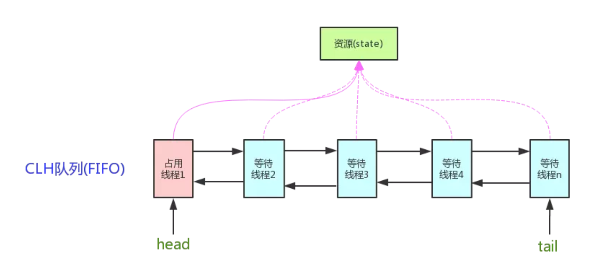
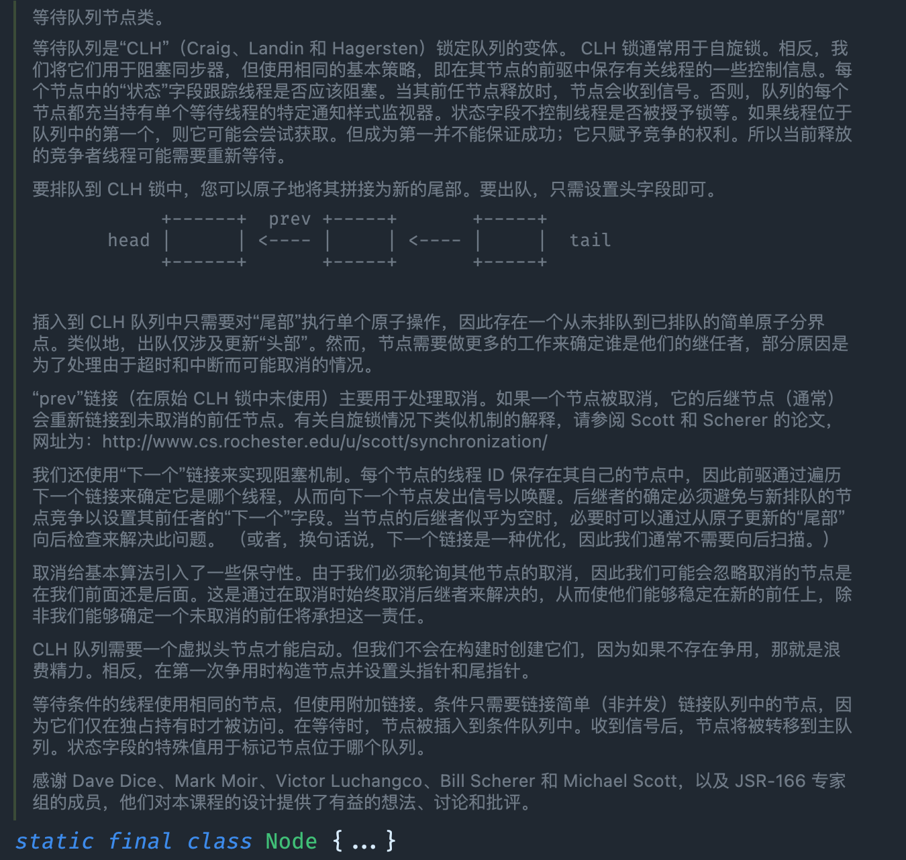

**AQS**是`AbstractQueuedSynchronizer`的简称，即`抽象队列同步器`，从字面上可以这样理解:

- 抽象：抽象类，只实现一些主要逻辑，有些方法由子类实现；
- 队列：使用先进先出（FIFO）的队列存储数据；
- 同步：实现了同步的功能。

AQS 是一个用来构建锁和同步器的框架，使用 AQS 能简单且高效地构造出应用广泛的同步器，ReentrantLock，Semaphore，ReentrantReadWriteLock，SynchronousQueue，FutureTask 等等，都是基于 AQS 的。

## AQS 的数据结构

AQS 内部使用了一个 volatile 的变量 state 来作为资源的标识。

```java
private volatile int state;
```

同时定义了几个获取和改变 state 的 protected 方法，子类可以覆盖这些方法来实现自己的逻辑：

```java
getState()
setState()
compareAndSetState()
```

这三种操作均是原子操作，其中 compareAndSetState 的实现依赖于 Unsafe 的 `compareAndSwapInt()` 方法。

AQS 内部使用了一个先进先出（FIFO）的双端队列，并使用了两个引用 head 和 tail 用于标识队列的头部和尾部。其数据结构如下图所示：



但它并不直接储存线程，而是储存拥有线程的 Node 节点。



## AQS 的 Node节点

资源有两种共享模式，或者说两种同步方式：

- `独占模式（Exclusive）`：资源是独占的，一次只能有一个线程获取。如 ReentrantLock。

- `共享模式（Share）`：同时可以被多个线程获取，具体的资源个数可以通过参数指定。如 Semaphore/CountDownLatch。

一般情况下，子类只需要根据需求实现其中一种模式就可以，当然也有同时实现两种模式的同步类，如 ReadWriteLock。

AQS 中关于这两种资源共享模式的定义源码均在内部类 Node 中:

```java
static final class Node {
    // 标记一个结点（对应的线程）在共享模式下等待
    static final Node SHARED = new Node();
    // 标记一个结点（对应的线程）在独占模式下等待
    static final Node EXCLUSIVE = null;

    // waitStatus的值，表示该结点（对应的线程）已被取消
    static final int CANCELLED = 1;
    // waitStatus的值，表示后继结点（对应的线程）需要被唤醒
    static final int SIGNAL = -1;
    // waitStatus的值，表示该结点（对应的线程）在等待某一条件
    static final int CONDITION = -2;
    /*waitStatus的值，表示有资源可用，新head结点需要继续唤醒后继结点（共享模式下，多线程并发释放资源，而head唤醒其后继结点后，需要把多出来的资源留给后面的结点；设置新的head结点时，会继续唤醒其后继结点）*/
    static final int PROPAGATE = -3;

    // 等待状态，取值范围，-3，-2，-1，0，1
    volatile int waitStatus;
    volatile Node prev; // 前驱结点
    volatile Node next; // 后继结点
    volatile Thread thread; // 结点对应的线程
    Node nextWaiter; // 等待队列里下一个等待条件的结点


    // 判断共享模式的方法
    final boolean isShared() {
        return nextWaiter == SHARED;
    }

    Node(Thread thread, Node mode) {     // Used by addWaiter
        this.nextWaiter = mode;
        this.thread = thread;
    }

    // 其它方法忽略，可以参考具体的源码
}

// AQS里面的addWaiter私有方法
private Node addWaiter(Node mode) {
    // 使用了Node的这个构造函数
    Node node = new Node(Thread.currentThread(), mode);
    // 其它代码省略
}
```


## AQS 的源码解析

